 <tr>
   <td align="center"><h1>2020.2 Versal JTAG Boot Tutorial</h1>
   </td>
 </tr>
</table>

# Table of Contents

1. [Introduction](#introduction)

2. [Before You Begin](#before-you-begin)

3. [JTAG Boot Flow Basics](#jtag-boot-flow-basics)

4. [Quick-Start Instructions](#quick-start-instructions)

5. [Hardware Design Details](#hardware-design-details)

6. [Building the Tutorial Design](#building-the-boot-tutorial-design)

7. [Debug During Board Bring-up](#debug-during-board-bring-up)

8. [Resources for Custom Board Bring-up](#resources-for-custom-board-bring-up)

9. [References](#references)


# Introduction
Versal™ ACAP combines adaptable processing and acceleration engines with programmable logic and configurable connectivity to enable custom, heterogeneous hardware solutions for a wide variety of applications in Data Center, automotive, 5G wireless, wired network, and defense. Versal ACAP supports several primary boot modes for application flexibility. This tutorial highlights the JTAG primary boot mode flow since it is commonly used to bring up a new board.

See [Quick-Start Instructions](#quick-start-instructions) for the scripts used to generate the example tutorial reference design and instructions on how to program the VCK190 evaluation board with JTAG boot mode. Sample steps to set MIO/clock configurations for the reference design components are also provided. The reference design includes the Versal ACAP System Monitor, triple timer counter, platform management controller (PMC) peripherals, processing system (PS) peripherals, binary counters, and general purpose IO (GPIO). This reference design is created using the parts project type flow since that is the flow users would follow when creating their own custom board designs.

The [Resources for Custom Board Bring-up](#resources-for-custom-board-bring-up) section assists with custom board bring-up and debug. A script to read the Versal ACAP JTAG registers status and save the contents to a file for debug is provided.

## Objectives
After completing this tutorial, users should be able to:
* Understand the steps required for the JTAG boot mode flow.
* Build the tutorial reference design programmable device image (PDI).
* Program the VCK190 Versal device with the PDI in JTAG boot mode.
* Understand how to set PMC/PS peripheral configurations.
* Use JTAG registers for status and troubleshooting.
* Decode common BootROM and PLM error codes if encountered on new designs.
* Use resources for custom board bring-up and boot debug.

## Design Block Diagram

The JTAG boot tutorial scripts generate a Vivado reference design, which is detailed in the following diagram.

### Block diagram

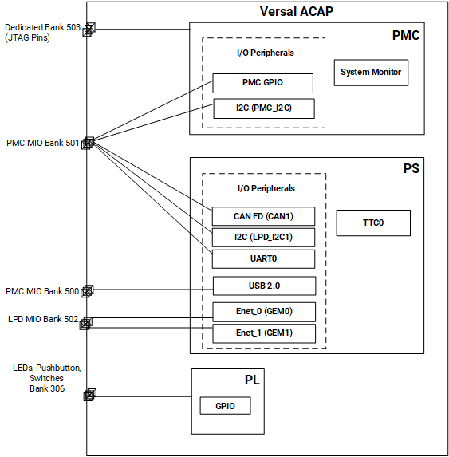

The design block diagram includes the following components:

|Component|Description|
|  ---  |  ---  |
|PMC system monitor|Monitors system voltages and temperatures.|
|PL GPIO|Adaptable engine programmable logic (PL) GPIO, inputs (switches, pushbuttons) and outputs (counter LEDs).|
|PMC GPIO|PMC general purpose IO used for the system controller trigger (ES1 workaround) and reset.|
|PMC_I2C|PMC I2C controller compatible with the I2C spec.|
|PS CAN_FD|Control area network flexible data-rate (CAN-FD) controller compatible with the CAN 2.0 spec.|
|PS TTC0| Processing system 32-bit triple timer counter|
|PS LPD_I2C1|PS I2C controller compatible with the I2C spec.|
|PS UART0|PS UART controller to support full-duplex asynchronous receiver and transmitter.|
|PS USB 2.0| PS USB 2.0 controller compliant with USB 2.0 spec.|
|PS GEM0|Gigabit Ethernet MAC (GEM) controller 0.|
|PS GEM1|Gigabit Ethernet MAC (GEM) controller 1.|


## Directory Structure
<details>
<summary> JTAG Boot Tutorial Directory Details </summary>

```
JTAG_Boot
|___Design.................Contains Vivado design input constraints
  |___pl.xdc...........................PL GPIO constraints file
|___Images.................Contains images that appear in README.md
  |___addcipsip.png....................Add CIPS IP
  |___addplxdc.png.....................Add PL constraints files
  |___addsources.png...................Add PL source files
  |___axigpio.png......................AXI GPIO IP defined
  |___bincntsetup.png..................Binary Counter IP defined
  |___bincounter.png...................IP Integrator additions
  |___blkdiagram20202.png..............PMC, PS, PL components in reference design
  |___bootphasesteps.png...............Versal ACAP boot phases
  |___cipsbootmode.png.................Boot mode selection
  |___cipscreatebd.png.................Vivado Create Block Diagram
  |___cipsiocfgmioprop.png.............Multiplexed IO (MIO) setup
  |___cipspspmcclkcfginput.png.........Clock inputs defined
  |___cipspspmcclkcfgpl03ttc.png.......Clock outputs setup
  |___cipspspmciocfg.png...............PMC Peripherals setup
  |___cipspspmciocfgbankv.png..........Define bank voltages
  |___cipspspmciocfgpmcgpiot.png.......GPIO setup
  |___cipspspmciogemusbcpm4uart.png....PS Peripherals setup
  |___cipspspmcipi.png.................Interrupts enabled
  |___cipspspmcplps.png................PL-PS AXI setup
  |___cipssysmonbasic.png..............System Monitor setup
  |___cipssysmonocsmon.png.............System Monitor on-chip supply monitors setup
  |___flownav.png......................Flow navigator steps
  |___hwmgrpdisel.png..................PDI programming in Hardware Manager
  |___jtagbootes1blockdiagram.png......Vivado IP connectivity diagram
  |___jtagpdi.png......................Reference design PDI components
  |___pgleds.png.......................Power rails power good LEDs on VCK190
  |___procrst.png......................Processor System Reset IP defined
  |___projname.png.....................Select project name  
  |___projtypertl.png..................Select project type
  |___puttycomsetup.png................PuTTY COM port setup
  |___railwaveform.png.................Example power rail check  
  |___runconnectauto.png...............IP connected        
  |___selectpart.png...................Versal part selection
  |___slice.png........................Slice IP defined
  |___smartconnect.png.................Smartconnect IP defined
  |___sysmonvolt.png...................Monitoring on-chip supplies
  |___vck190.png.......................VCK190 board view
  |___vck190sw1.png....................JTAG boot mode setting
  |___vck190railseq.png................Example power sequence
  |___vivadocreateproj.png.............Vivado project creation
|___Scripts................Contains TCL scripts to generate reference design and PDI, and to read JTAG registers
  |___create_jtag_refdesign.tcl........Generates the reference design PDI (runs place and route, implementation)
  |___load_jtag_pdi.tcl................Commands for Vivado Hardware Manager load PDI
  |___read_jtag_regs.tcl...............Commands to read Versal JTAG registers status to file that can be shared for debug
  |___run.tcl..........................Top tcl for project setup, calls create_jtag_refdesign.tcl
|___README.md...............Includes tutorial overview, steps to create reference design, and debug resources
```
</details>

# Before You Begin

Recommended general knowledge of:
* VCK190 evaluation board
* Versal primary boot mode
* Versal PMC/PS peripherals
* Xilinx Vivado Design Suite  

<details>

<summary> Key Versal Reference Documents </summary>

* VCK190 Evaluation Board User Guide [(UG1366)](file:///C:/Docs/UGs/Boards_UG/ug1366-vck190-eval-bd-102720-XART_review.pdf)
* Versal Technical Reference Manual [(AM011)](https://www.xilinx.com/support/documentation/architecture-manuals/am011-versal-acap-trm.pdf)
* Versal System Software Developers User Guide [(UG1304)](https://www.xilinx.com/cgi-bin/docs/rdoc?v=latest;d=ug1304-versal-acap-ssdg.pdf)
* Versal Control Interfaces and Processing System (CIPS) [(PG352)](https://www.xilinx.com/cgi-bin/docs/ipdoc?c=versal_cips;v=latest;d=pg352-cips.pdf)

</details>

<details>

<summary> Versal Terms </summary>

|Term|Description|
|  ---  |  ---  |
|Platform management controller (PMC)|Manages Versal ACAP boot and the life cycle management of the device. The PMC ROM Code Unit (RCU) and platform processing unit (PPU) are responsible for booting the device.|
|ROM code unit (RCU)| Includes a microblaze processor that executes the BootROM to initiate the boot phase2: boot setup.|
|Platform processing unit (PPU)|Includes a microblaze processor that executes the platform loader and manager (PLM) to initiate the boot phase3: load platform.|
|Scalar engines|Includes the processing system (PS) Dual-Core ARM Cortex R5F and A72.|
|Adaptable engines|Includes Versal adaptable hardware also referred to in this tutorial as programmable logic (PL).|
|Control Interfaces and Processing System (CIPS)|CIPS LogiCORE IP sets the configuration of PMC/PS peripherals, clocks, and MIO.|
|BootROM|Responsible for initial security and boot mode interface checks. Reads and processes the PDI boot header. Releases the PMC PPU to complete the boot phases. See the Versal Technical Reference Manual [(AM011)](https://www.xilinx.com/support/documentation/architecture-manuals/am011-versal-acap-trm.pdf) for more detail on BootROM.|
|Platform loader and manager (PLM)|Responsible for the final boot phases to load the PDI. Executes supported platform management libraries and application user code. See the Versal System Software Developers User Guide [(UG1304)](https://www.xilinx.com/cgi-bin/docs/rdoc?v=latest;d=ug1304-versal-acap-ssdg.pdf) for more detail on the PLM.|
|Programmable device image (PDI)|Boot image for programming and configuring the Versal ACAP device. See the BootGen UG1283 for details on the format. See system software developers user guide for details on how PLM manages the images and partitions.|
|MIO| Multiplexed IO pins that can be configured for different peripherals and functions.|
|DIO| Dedicated IO pins dedicated for specific functions, such as JTAG (TCK, TMS, TDI, TDO) or power-on reset (POR_B).|

</details>

## Tutorial Requirements

This tutorial is demonstrated on the VCK190 ES board, currently available via early access. Once purchased, download the necessary files from the lounge and ensure you have the correct licenses installed. If you do not have a board and ES license contact your Xilinx sales representative. See https://www.xilinx.com/products/boards-and-kits/vck190.html for more information.

Note: This tutorial targets the VCK190 evaluation board, but the methodology flow also applies to the VMK180 evaluation board.

#### Hardware Requirements:

* Host machine with an operating system supported by Vivado Design Suite and Vitis 2020.2.
* VCK190 ES1 evaluation board, which includes:
  * Versal ACAP XCVC1902-2VSVA2197
  * AC power adapter (100-240VAC input, 12VDC 15.0A output).
  * System controller microSD card in socket (J302).
  * USB Type-C cable (for JTAG and UART communications).

#### Software Requirements:
In order to build and run the JTAG Boot tutorial reference design, the following must be available or installed:
  * Vivado Design Suite and Vitis 2020.2:
  	- Visit https://www.xilinx.com/support/download.html for the latest tool version.
  	- For more information on installing the Vivado Design Suite and Vitis, refer to [UG1400 Vitis Unified Software Platform Embedded Software Development](https://www.xilinx.com/support/documentation/sw_manuals/xilinx2020_2/ug1400-vitis-embedded.pdf).
  * Scripts to generate the reference design are provided in the [Quick-Start Instructions](#quick-start-instructions).
  * UART serial terminal recommended:
	- Vitis serial Terminal or a terminal emulator program for UART (i.e. Putty or Tera Term) can be used to display valuable PLM log boot status.  
    - When UART is not available, Vivado Design Suite and Vitis xsct/xsdb command line tools can be used to read the plm log after a boot attempt. See [Debug During Board Bring-up](#debug-during-board-bring-up) for detail.


# JTAG Boot Flow Basics

The Versal PMC has two microblaze processors, RCU and PPU, that perform the boot and configuration. See Versal ACAP TRM [(AM011)](https://www.xilinx.com/support/documentation/architecture-manuals/am011-versal-acap-trm.pdf) or Versal ACAP SSDG [(UG1304)](https://www.xilinx.com/cgi-bin/docs/rdoc?v=latest;d=ug1304-versal-acap-ssdg.pdf) for additional boot mode details.

This section provides information about the JTAG boot flow that is initiated during the [Quick-Start Instructions](#quick-start-instructions) program. The VCK190 is powered on initiating the Versal ACAP device power-up sequence. The POR_B pin is released after the REF_CLK is stable and key supplies are valid (ie. PMC_VCC, VCCAUX_PMC, and VCCO_503). Then the JTAG boot flow boot phases begin, as detailed in the following image:

###### Versal ACAP Boot Phases
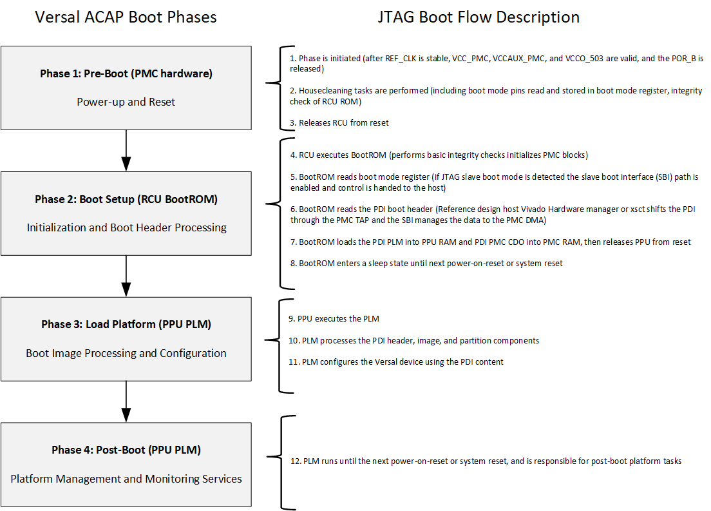

# Quick-Start Instructions

## Build Tutorial Design  

The following instructions detail how to build the JTAG Boot tutorial reference design and create the PDI.

 1. Copy the Design and Scripts directories and files to a local project directory.
 The following is an example of the top level directory jtag_boot:

```
	jtag_boot
	|___design
	    |___pl.xdc
	|___scripts
	    |___ run.tcl  
	    |___ create_jtag_refdesign.tcl
	    |___ load_jtag_pdi.tcl
	    |___ read_jtag_regs.tcl
```

 2. Ensure Beta Devices are enabled (ES1 target)

 3. Launch Vivado Design Suite 2020.2

 4. In the Vivdado Tcl console, cd to the tutorial directory (i.e., jtag_boot).

 5. Source the Tcl from the tutorial directory as follows:

 ```tcl
 	source ./Scripts/run.tcl
 ```

 Sourcing the run.tcl script does the following:
  * Creates a project directory
  * Sources and runs the create_jtag_refdesign.tcl, which does the following:
      * Selects target Versal VC1902 ES1 device.
      * Loads design source constraints and creates ports.
      * Creates blocks, configures and connects IP (i.e., control, interfaces, and processing system (CIPS), Smartconnect).
      * Runs placement and routing.
      * Creates a programmable device image (PDI).

## Setup VCK190 Board

The Xilinx VCK190 evaluation board is used to demonstrate loading the tutorial reference design PDI into the Versal ACAP using the JTAG boot mode. This section describes VCK190 hardware basic setup.

## VCK190 Board

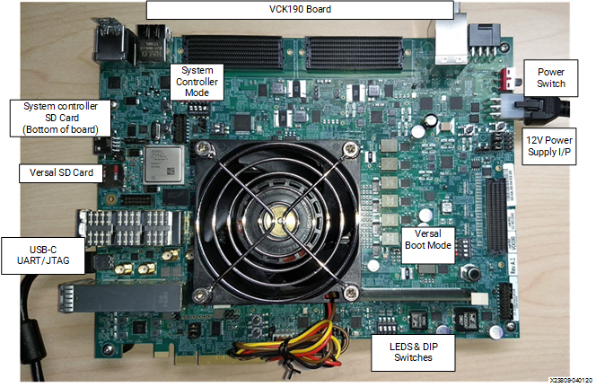


## VCK190 Connections

Before you begin, ensure the SW13 power switch is off.

1. Connect the power cable to the VCK190 J16.

2. Connect the USB-C cable used for JTAG/UART from your host system (where Vivado is installed) to VCK190 J207.

3. Set the Versal ACAP to JTAG Boot Mode SW1[1:4]=0000 (which sets pins MODE[0:3]=0000) (All Up).

###### VCK190 Boot Modes Switch (SW1)
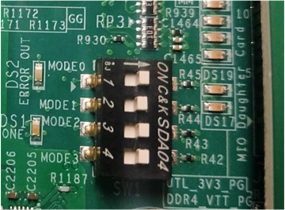


## VCK190 System Controller Settings
The VCK190 includes an on-board system controller that assists with the Versal ACAP power sequencing management. Ensure the following are set for the system controller:

* System Controller MODE pin settings SW11[1:4]= 0111 (Up, Down, Down, Down) for SD mode.

* System Controller SD card is inserted into the VCK190 J206 slot (located at the bottom of the board).

* VCK190 system controller image is pre-programmed out of the box. If any issues occur with the image, the SD card can be reprogrammed with the VCK190 system controller design image located here:
  * [System Controller Image File Tutorial to reprogram](https://www.xilinx.com/member/vck190_headstart/Update_System_Controller_uSD_Card_Instructions.pdf)
  * [VCK190 system controller image](https://www.xilinx.com/member/vck190_headstart/Board_Framework_Phase1Beta_V1.02_wVadj.img.zip)  

<details>

<summary> VCK190 ES1 Power Sequence Reference </summary>     

For Versal ACAP ES1 and production power sequencing requirements see the Xilinx Power Estimator [UG1275](https://www.xilinx.com/support/documentation/sw_manuals/xilinx2020_2/ug1275-xilinx-power-estimator-versal.pdf).

Custom boards use the Vivado part project type flow, so this reference design demonstrates that flow.

Designs targeted for only the VCK190, and that do not intend to port a design to a custom board, are recommended to use the boards project type flow since it includes board specific presets. See the Versal Embedded Design Tutorial [(UG1305)](https://www.xilinx.com/cgi-bin/docs/rdoc?v=latest;d=ug1305-versal-acap-edt.pdf) for an example of the boards project type flow.  

The VCK190 ES1 power solution meets the Versal ACAP ES1 power sequence requirement by holding the VCC_RAM rail off when the board is powered on. The VCK190 ES1 system controller monitors the PMC GPIO MIO37 to determine when the Versal ACAP platform loader and manager has completed the isolation register write steps included in the PDI. When the write is complete, the system controller will ramp the VCC_RAM rail to match the supported ES1 power sequence. This is why the VCC_RAM power good LED is off at power up until the boot is initiated.

</details>

## Program Tutorial Design

1. Set SW13 to the ON position.

2. Check that the power good (PG) LEDs are all on, except the VCC_RAM PG LED is off and reserved LEDs (reserved LEDs can be on or off).

3. Open the 2020.2 Vivado Hardware Manager.

4. Select Open New Target and connect the VCK190.

5. Right-click Versal device xcvc1902_1 and select program device.

6. Select the tutorial reference design PDI: c:\jtag_boot\runs\project_1.runs\impl_1\design_1_wrapper.pdi

###### Vivado Hardware Manager Program

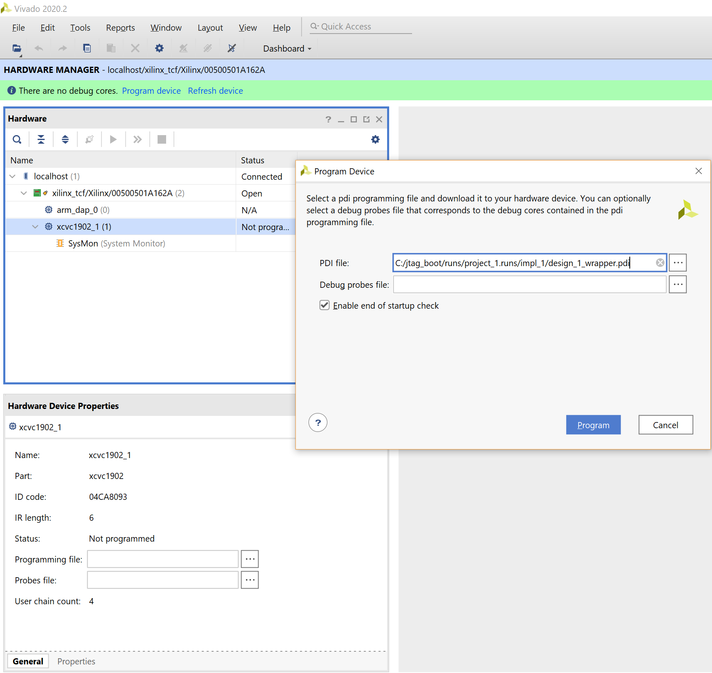

Note: For steps 3-5, 2020.2 Vivado xsdb.bat or Vitis xsct.bat can be used to program the device. This tutorial highlights xsct in the examples since the commands for xsct and xsdb are the same. Run the following commands to program the PDI with xsct:
```
xsct% connect
xsct% ta 1
xsct% device program {C:\jtag_boot\runs\project_1.runs\impl_1\design_1_wrapper.pdi}

```

## Tutorial Design Load Check  

When the tutorial design is loaded successfully, the following are seen:

* VCC_RAM power good LED is on.

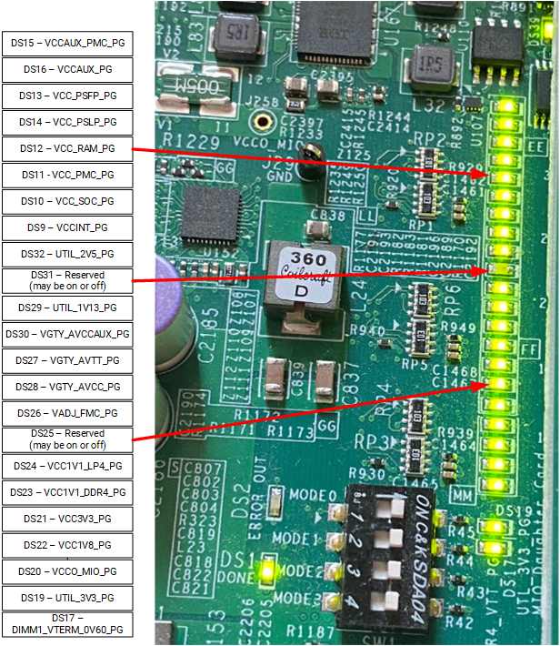

* DS1 DONE LED on.
* DS3-DS5 PL GPIO LEDs are toggling (connected to binary counters in design).
* DS2 ERROR_OUT LED is off (indicating no errors have occurred during the JTAG boot).

# Hardware Design Details

This tutorial design has PMC/PS peripherals and PL GPIO used to demonstrate board bring-up with JTAG boot. When the run.tcl script is sourced you will get a Vivado block design output, as detailed in the Vivado Block Design.

#### Vivado Block Design
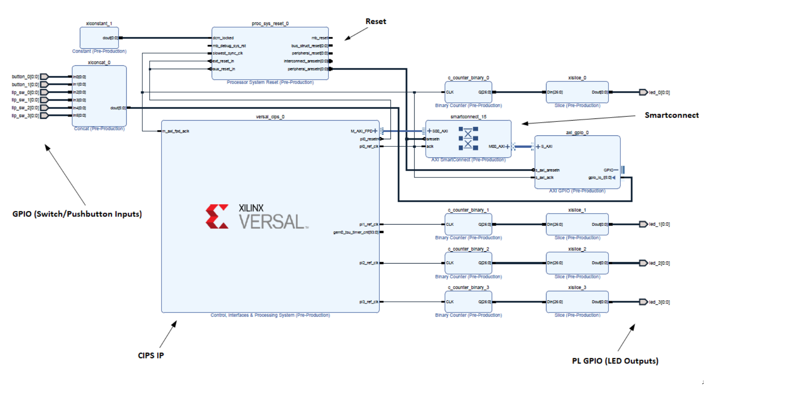


# Building the Boot Tutorial Design  

The [Quick-Start Instructions](#quick-start-instructions) create the reference design. All user designs require CIPS IP for boot, but CIPS other configuration options for peripherals and features is specific to the design. The next sections highlight key steps implemented by the scripts for this tutorial reference design.

## Create XDC files

The tutorial reference design PL GPIO Xilinx design constraints file (xdc) is provided to assign LEDs, pushbuttons, and dip switch functions to the package pins based on the VCK190 schematic pinout. For VCK190 schematic detail see the [VCK190 schematic](https://www.xilinx.com/member/vck190_headstart/VCK190_VMK180_REVA04.pdf).

The PL GPIO (pl.xdc) reference constraints file is located in the design directory. The following shows a portion of the pl.xdc standard constraints file format.

 ```
# pl.xdc: Constraints for the PL GPIO (2 push buttons, 4 LEDs, and 4 dip switches)
set_property PACKAGE_PIN G37 [get_ports push_button_0]
set_property PACKAGE_PIN G36 [get_ports push_button_1]

set_property PACKAGE_PIN H34 [get_ports led_0]
```

The PS and PMC controllers/peripherals pinouts are defined by the Vivado CIPS IP configuration as shown in the following sections.

## Create Vivado Project Setup  

Key steps to create a new project are highlighted in this section.  

1. Launch Vivado 2020.2


2. Select Create Project and click Next to start the Create a New Vivado Project wizard.

###### Vivado Create Project

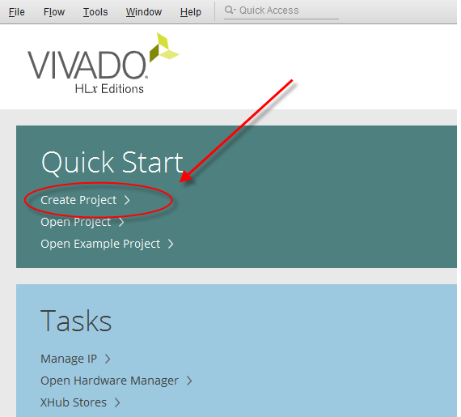

3. Select the project name and project location and click Next.

###### Vivado Project Name


4. Select the project type as RTL Project and click Next.

###### Select Vivado Project Type


Users can input both RTL source and constraint files for custom designs. This reference design only requires the pl.xdc constraint file.

5. Select next without adding source files.

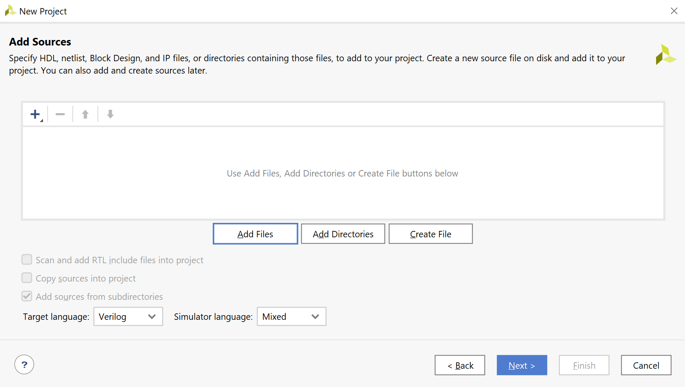

6. Select the constraints pl.xdc file and click Next.


This tutorial demonstrates the part project type flow as a reference because custom board designs will use that flow. It is recommended that user designs only targeting Xilinx evaluation boards use the boards flow because the tools will include board presets based on the available peripherals. The Versal Embedded Design Tutorial [(UG1305)](https://www.xilinx.com/cgi-bin/docs/rdoc?v=latest;d=ug1305-versal-acap-edt.pdf) demonstrates the Versal VCK190 evaluation platform board project type flow.

7. Select the Vivado default part XCVC1902-vsva2197-2MP-e-S and click Next.

###### Select Vivado Default Part


8. Click Finish and create the block diagram.  

## Create Block Design
The reference design in this tutorial uses IP Integrator. CIPS IP is required by all designs for boot, but is also used to configure PMC and PS peripherals, controllers, MIO, clocks, SYSMON monitoring capability, enable interrupts, and setup PS Master and Slave interfaces for NoC. The following sections highlight key step IP setup steps used by the tutorial scripts to create the reference design.

Once the project manager has loaded:

1. Select Create Block Design from the IP Integrator  
2. Enter a Design name and select OK.

###### IP Integrator - Create Block Diagram


3. Select the “+” sign to add IP and search Control, Interfaces & Processing System (CIPS).


###### Include CIPS


4. Expand the Boot Mode menu and select IO Configuration.

5. Setup the input REF_CLK to 33.333MHz for the VCK190.

###### CIPS Boot Mode Setup
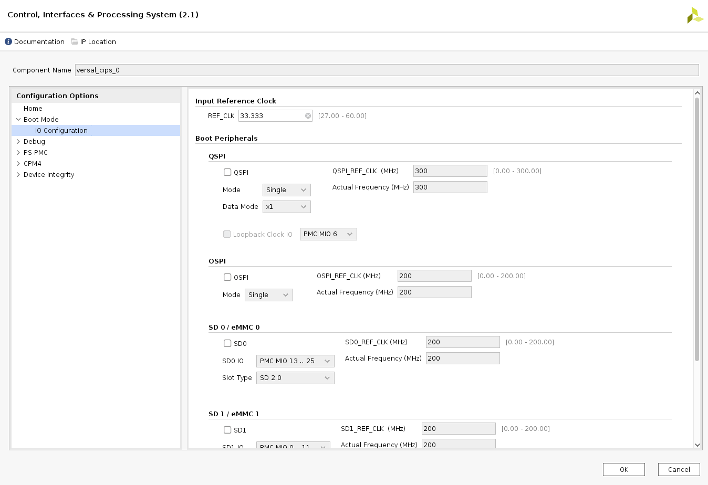

Notes:
  * JTAG boot mode uses only dedicated IO pins, no additional selection is required for the boot peripherals section since there are not any MIO to configure in this boot mode.
  * User designs that are created with non-JTAG boot modes must setup the targeted boot peripheral under the boot mode tab.
  * See the [Versal Embedded Design Tutorial UG1305](https://www.xilinx.com/cgi-bin/docs/rdoc?v=latest;d=ug1305-versal-acap-edt.pdf) for a QSPI boot flow example and [CIPS LogiCORE PG352](https://www.xilinx.com/cgi-bin/docs/ipdoc?c=versal_cips;v=latest;d=pg352-cips.pdf) for more information on the options.
  * A single PDI can support multiple boot modes if the MIO pins do not conflict. For example, the VCK190 pinout supports can support a single PDI that enables QSPI, SD1 3.0, and JTAG boot mode options. The boot mode pins MODE[3:0] would determine which primary boot mode is used for boot.


6. Expand the PS-PMC and select IO Configuration to setup the MIO Voltage Standard and Peripheral MIO.

7. Select LVCMOS1.8 from the Bank0 (MIO), Bank1(MIO), Bank2, and Bank3 dropdown menu's. For this tutorial reference design, 1.8V is used on the PMC DIO, PMC MIO, and PS LPD MIO bank.

###### CIPS PS-PMC IO Configuration- MIO Voltage Standard
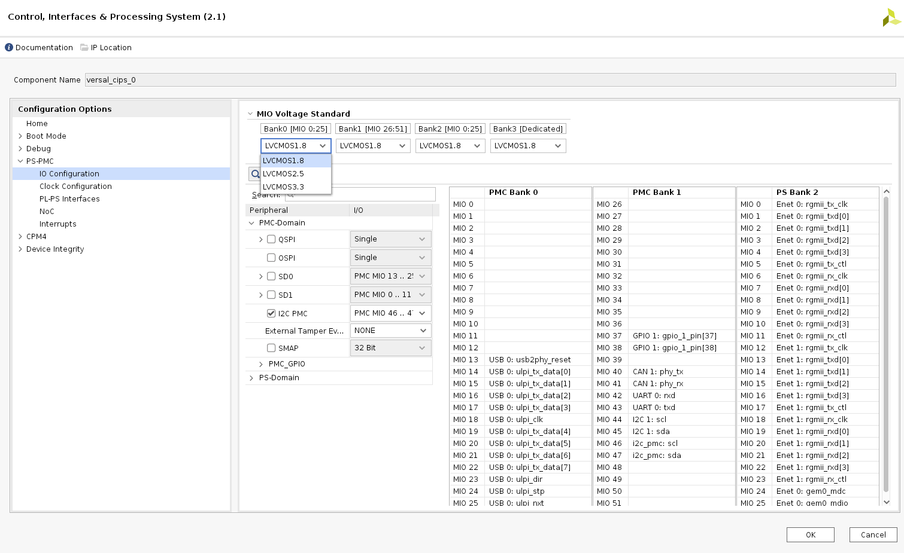

The Peripheral section is grouped by the PMC domain and PS domain related peripherals and controllers. Each peripheral will have unique MIO and interface options. Below are some example peripheral setups used in the reference design. For the PMC peripherals, this tutorial uses the PMC I2C controller and PMC GPIO features.

8. Assign the peripheral to I2C PMC and select MIO[46:47] from the pull-down menu.

###### CIPS PS-PMC IO Configuration - PMC Peripheral
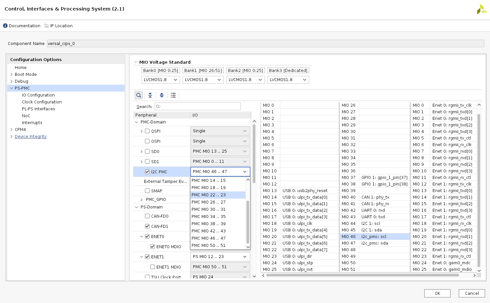

For the PS domain peripherals, the steps are similar to the PMC domain peripherals setup. The MIO selected in this reference design are based on the VCK190 pinout for the interfaces.

9. Select each targeted PS peripheral (LPD_I2C1, USB, UART0, USB, ENET0 (GEM0), ENET1 (GEM1), CAN_FD, and TTC) and assign the MIO from the pull-down menu. As an example, the CAN_FD1 is assigned to the PMC MIO[40:41].


###### CIPS PS-PMC IO Configuration - PS Peripherals
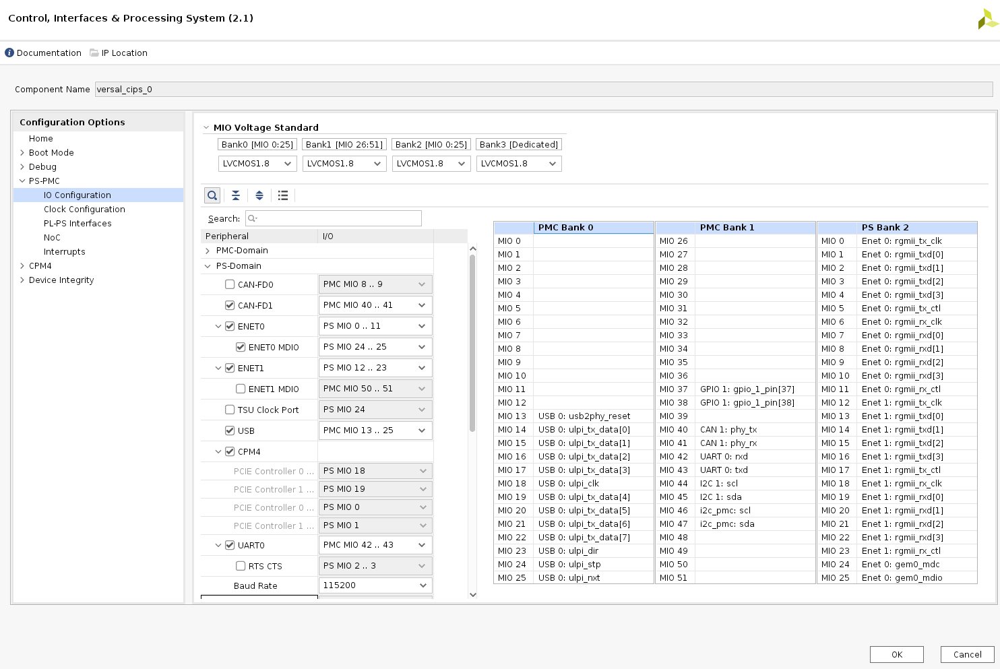


10. Select the MIO PIN view (highlighted in red below)

11. Select the External Usage pull-down menu to set GPIO for the PMC MIO[37:38]. PMC MIO 37 the VCK190 ES1 system controller VCC_RAM power sequence trigger and PMC MIO 38 is assigned to PCIE_PERST_B.

###### CIPS PS-PMC IO Configuration- PMC GPIO
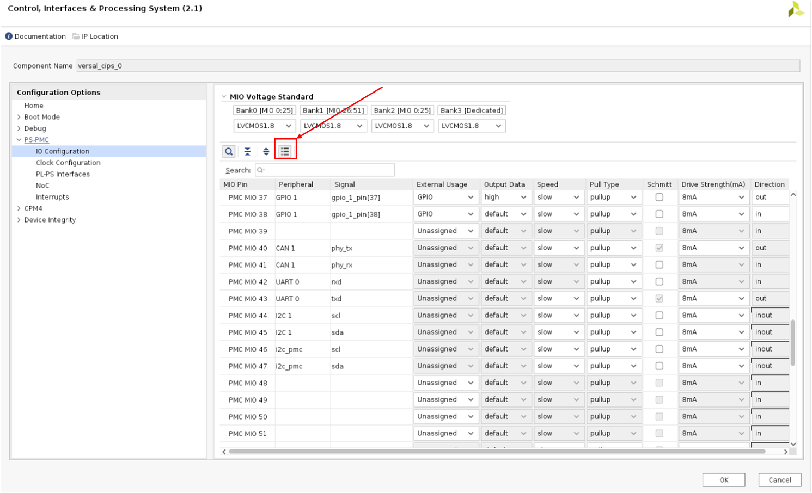


##### Adjust MIO Configuration Pin Settings:
Users can change the MIO Drive Strength, slew rate, and pullup/pulldown settings for a custom board.

12. Select the MIO pin pull-down menus to set configuration of the pins. Example tutorial reference design MIO settings are shown.

###### CIPS Customize and Configure MIO  
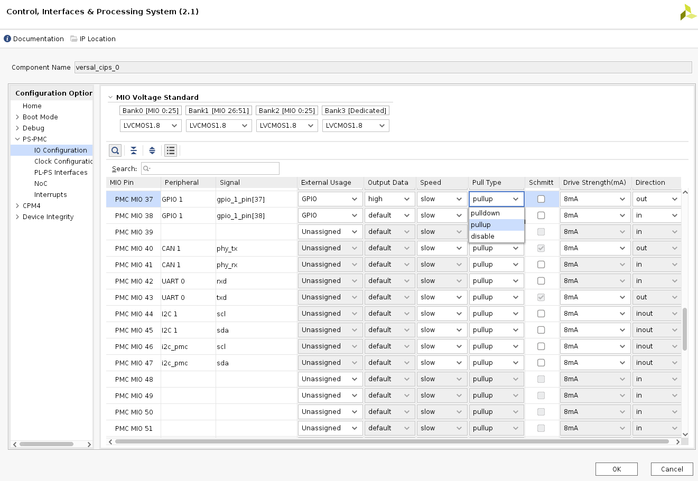

13. After the MIO pin options are selected, revert to the standard view by clicking the MIO PIN View button again.

14. Expand the PS-PMC Configuration option and select the clock configuration.

15. Select the Input Clocks tab and ensure the REF_CLK is set to 33.333MHz for the VCK190.

###### CIPS Configuration of Input Clocks  
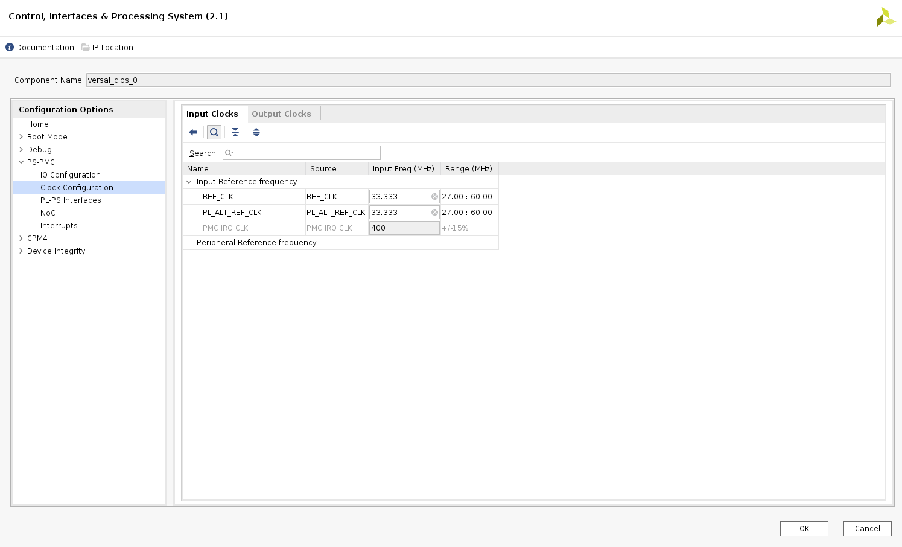

CIPS will attempt to manage your required clock frequencies in the auto clocking mode (default). It will consider the user input requirements (i.e., the PLLs selected and requested frequencies) to provide the best combination. Auto clocking mode is recommended for most designs because it provides optimal performance based on inputs. There is also a manual clocking mode option that allows users to make adjustments if the auto selections do not meet their requirements.

16. Select the Output Clocks tab and select the PL fabric clocks (used to drive the binary counters in the reference design).

17. Select the TTC0 source pull-down menu and select APB as the source.

###### CIPS Configuration of Output Clocks  
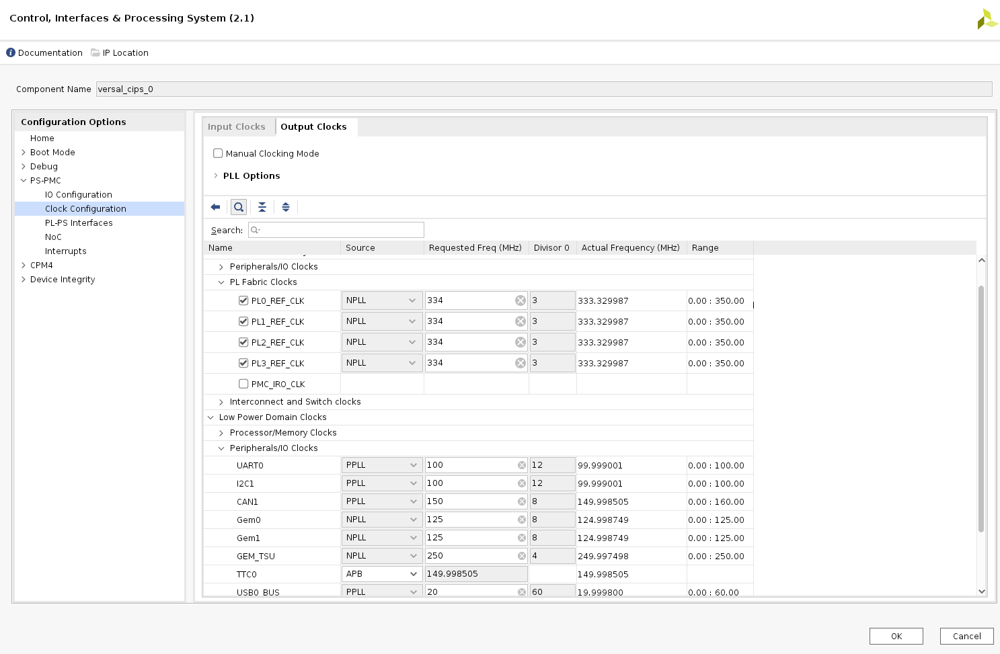

CIPS also configures the number of PL resets and the AXI master and slave interfaces required in the design.

18. Set the Number of PL Resets to 1 and select the AXI master interface (M_AXI_FPD) data width as 128.

###### Configuration of PL-PS Interfaces

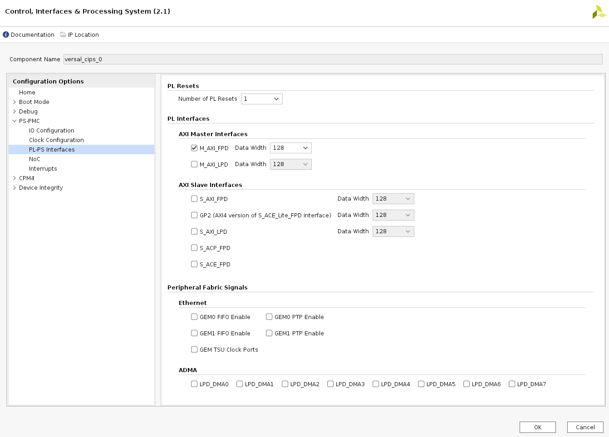

Interrupts are also configured within CIPS. This includes debug processor interrupts, PL to PS interrupts from LPD or FPD, and inter processor interrupts (IPI).

19. Set Inter Processor Interrupt configuration to enable the Master PMC, PSM, and A72 as shown in the following image.

###### Configuration of interrupts

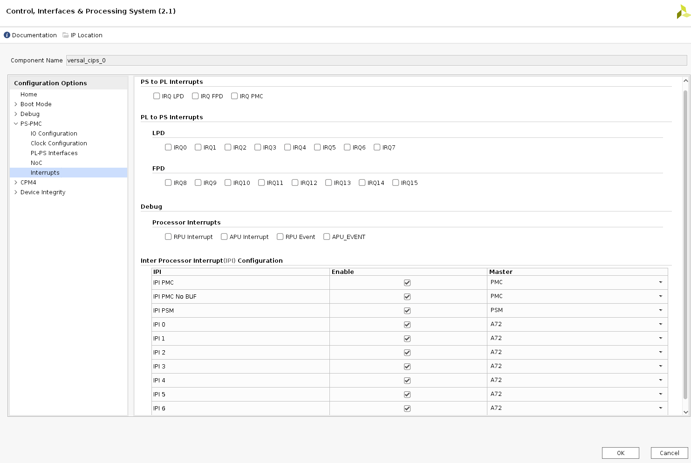

The Versal device system monitor is a valuable resource for board bring-up. There are various monitoring options that can be used to check temperature, on-chip rail monitors, and external supplies. For the VCK190 reference design, the system monitor on-chip supply monitor is enabled for the critical device supplies for PMC, PS, BBRAM, and PL/NoC resources.

20. Expand the PS-PMC and select the Device Integrity to setup the system monitor.

21. Set the basic configuration for system monitor as shown in the following image.

###### Enabling System Monitor - basic setup


22. Select the On Chip Supply Monitor tab and set the CUSTOMER_SUPPLY_VOLTAGE power rails to enable the monitoring capability as shown. The System Monitor temperature and external supply monitor tabs are left as default.

###### CIPS System Monitor - supply setup

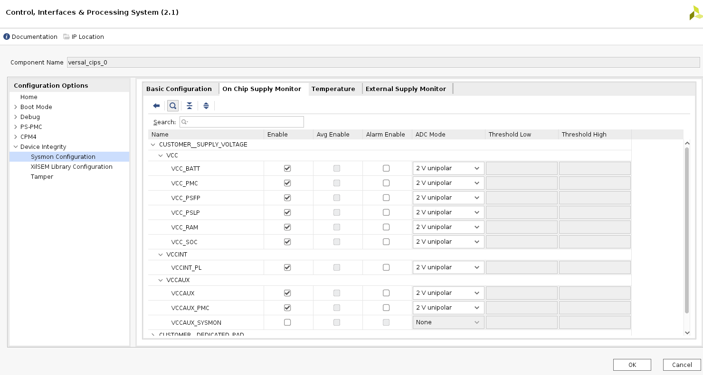


23. Select OK to close the CIPS IP once all the settings have been entered.

There are other sections in the CIPS IP (i.e., debug and tamper) that are not used by this reference tutorial. Designs that use these features should setup the options in those tabs. Refer to the CIPs IP LogiCore Product Guide [(PG352)](https://www.xilinx.com/support/documentation/ip_documentation/versal_cips/v2_1/pg352-cips.pdf) for details.

#### Additional IP Resources
In addition to the CIPS IP, other IP used for the tutorial reference design are highlighted. The binary counters, AXI SmartConnect, Concat, AXI GPIO, constant, processor system reset, and slice IP are all used in the design for function and connectivity. Each of these IP are selected from the IP integrator menu.

###### IP Selection


Example reference design IP setups are detailed in this section. There are four binary counter IP connected with slice IP and the AXI SmartConnect IP connected with AXI GPIO.


24. Select the binary counter IP from the IP selection. The binary counter IP has four instances in the reference design with the same basic and control settings.

25. For each of the four instances of the binary counter IP set the Output Width to 27 and Increment Value (Hex) 1 to create an up counter. These four counters are clocked by the Versal ACAP PL0-PL3 reference clocks configured in CIPS.

See the Binary Counter LogiCORE IP Product Guide [(PG121)](https://www.xilinx.com/support/documentation/ip_documentation/counter_binary/v12_0/pg121-c-counter-binary.pdf) for more information.

###### Binary Counter Setup

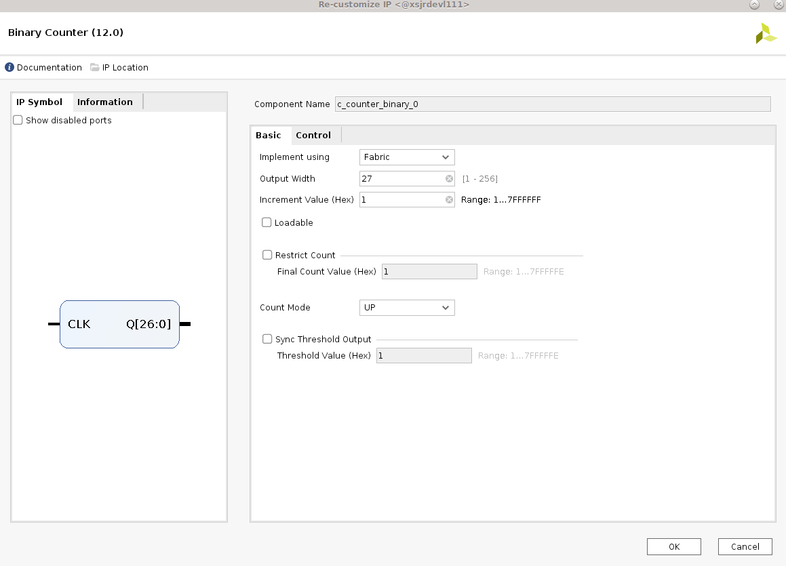

26. Select the Slice IP from the IP selection to add to the design.

27. The slice IP is used to display the counter MSB to the LEDs using the widths shown.

###### Slice Setup


28. Select the AXI SmartConnect IP from the IP selection to add to the design.

29. Set AXI SmartConnect standard properties as shown.

The AXI SmartConnect IP is used connect a slave AXI interface to a master AXI interface in the FPD for the reference design. See the SmartConnect LogiCORE IP Product Guide [(PG247)](https://www.xilinx.com/support/documentation/ip_documentation/smartconnect/v1_0/pg247-smartconnect.pdf) for more information.

###### AXI SmartConnect Setup
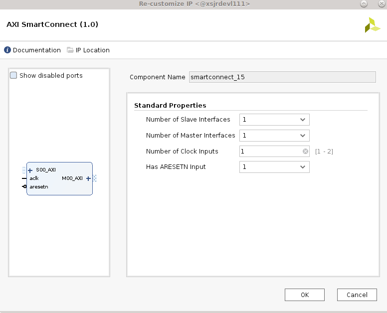

30. Select the AXI GPIO IP from the IP selection to add to the design.

31. Set the AXI GPIO input and the width settings as shown.

The AXI GPIO IP is used to connect the slave AXI interface to six GPIO inputs, which are connected to reference design dip switches and pushbuttons on the VCK190. See the AXI GPIO LogiCORE IP Product Guide [(PG144)](https://www.xilinx.com/support/documentation/ip_documentation/axi_gpio/v2_0/pg144-axi-gpio.pdf) for more information.

###### AXI GPIO Setup


32. Select the Processor System Reset IP from the IP selection to add to the design.

33. Set the Processor System Reset settings as shown.

The Processor System Reset IP is used to setup a custom reset using the PL reset. See the Processor System Reset Module LogiCORE IP Product Guide [(PG164)](https://www.xilinx.com/support/documentation/ip_documentation/proc_sys_reset/v5_0/pg164-proc-sys-reset.pdf) for more information.

###### Processor System Reset Setup

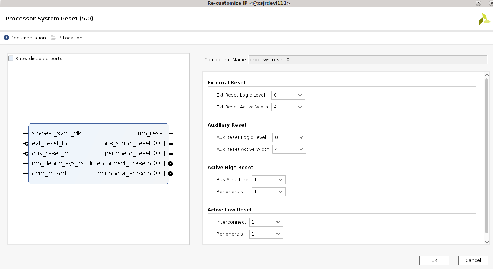


#### Run Connection Automation
34. Once the desired IPs have been included and setup in the design, select Run Connection Automation (as shown in the following image).

###### Run Connection Automation


## Saving IP settings
After the IP blocks have been connected and validated on the board, the setup can be saved to load in other projects for the same board target. The following tcl command can be ran to load initial presets:

```
write_bd_tcl ./mycustom_bd1.tcl
```
The tcl can be sourced to setup the IP in an existing project. See the Vivado Design Suite Tcl Command Reference Guide [(UG835)](https://www.xilinx.com/support/documentation/sw_manuals/xilinx2020_1/ug835-vivado-tcl-commands.pdf) for more information.

## Vivado Synthesis, Implementation, and Program
After the IP blocks have been included, the Vivado Flow synthesis and implementation steps are initiated by clicking on Run Synthesis followed by Run Implementation shown in the flow navigator. These steps are included in the tutorial scripts.

###### Project flow - Synthesis, Implementation
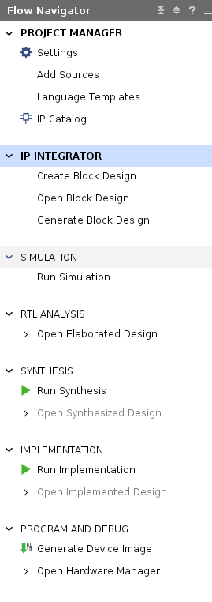

To program the device with Vivado hardware manager, the board connection is established and the pdi is selected. See the [Quick-Start Instructions](#quick-start-instructions) for more information.

## Versal ACAP BIF and PDI Example
The PDI can have many different components included depending on the design. Refer to the Bootgen User Guide [(UG1283)](https://www.xilinx.com/support/documentation/sw_manuals/xilinx2020_2/ug1283-bootgen-user-guide.pdfUG1283) for details on the boot image file (BIF) format and the PDI components. The following shows the BIF and PDI components for the example JTAG boot reference design.

###### Tutorial Reference Design BIF
```
new_bif:
{
 id_code = 0x04ca8093
 extended_id_code = 0x01
 id = 0x2
 image
 {
  name = pmc_subsys
  id = 0x1c000001
  partition
  {
   id = 0x01
   type = bootloader
   file = gen_files\executable.elf
  }
  partition
  {
   id = 0x09
   type = pmcdata, load = 0xf2000000
   file = c:/Xilinx/Vivado/2020.2/data/parts/xilinx/devint/vault/versal/data/cdo/devices/xcvc1902/topology_xcvc1902.v2.cdo
   file = gen_files\pmc_data.cdo
  }
 }
 image
 {
  name = lpd
  id = 0x4210002
  partition
  {
   id = 0x0C
   type = cdo
   file = gen_files\lpd_data.cdo
  }
  partition
  {
   id = 0x0B
   core = psm
   file = static_files\psm_fw.elf
  }
 }
 image
 {
  name = pl_cfi
  id = 0x18700000
  partition
  {
   id = 0x03
   type = cdo
   file = design_1_wrapper.rcdo
  }
  partition
  {
   id = 0x05
   type = cdo
   file = design_1_wrapper.rnpi
  }
 }
 image
 {
  name = fpd
  id = 0x420c003
  partition
  {
   id = 0x08
   type = cdo
   file = gen_files\fpd_data.cdo
  }
 }
}

```

The following image details the reference design PDI components that follows the BIF file order. Understanding the partition order is helpful when reviewing the example PLM log and the order the partitions are loaded in the next sections.

###### Tutorial Reference Design PDI Composition
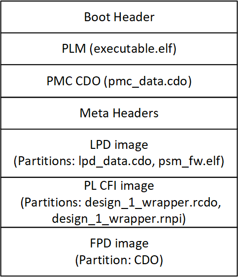

# Debug During Board Bring-up

The Vivado Hardware Manager and xsct are helpful debug tools if an issue is encountered during boot. Vivado hardware manager provides the following options for debug:

* Reducing the TCK default rate frequency in hardware manager can help to identify any clock edge or signal integrity issues. This option is also helpful to isolate issues on larger JTAG chains where buffering is needed.

* System monitor (SYSMON) voltage and temperature readings can ensure the power rails are on and operating within the expected Versal ACAP data sheet ranges. If a boot issue is encountered the power rails should be confirmed. The tutorial reference design enables monitoring of key power rails. After the reference design PDI is programmed into the Versal ACAP device, the sensor information can be viewed in the hardware manager (shown in the following image).

## System Monitor reading with reference design

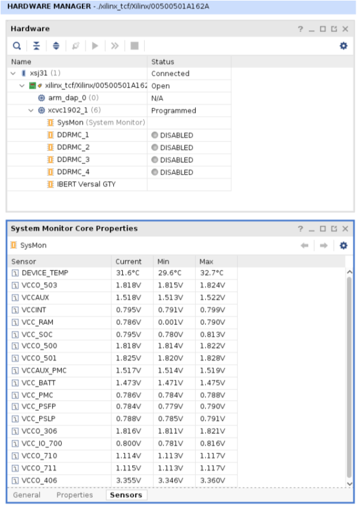

## Reading JTAG Registers

This tutorial includes a script (/Scripts/read_jtag_regs.tcl) with commands to read out the JTAG registers (i.e., IDCODE, EXTENDED_IDCODE, DNA, JTAG_STATUS, USERCODE, ERROR_STATUS) in the Vivado hardware manager if debug is required.  

Versal ACAP devices have specific identification checks that prevent the incorrect device type or device version (ES1 vs. production) from being programmed. The device IDCODE should be confirmed if boot errors are encountered when programming the PDI.

 ##### Checking the Device Identifiers

  * Reading the IDCODE Register- This 32-bit register stores the device identification base family and revision (VCK190 ES1 IDCODE is 0x04CA8093).

  * Reading the EXTENDED_IDCODE- This 32-bit register is an extension to the IDCODE. 14 bits in this register define the Versal code extension (VCK190 ES1 EXTENDED_IDCODE is [27:14]=0000 0000 0000 01).

  * Reading the DNA- This 128 bit register uniquely identifies the device.


Versal ACAP also has two JTAG registers (the JTAG_STATUS 36-bit register and the ERROR_STATUS 160-bit register) that provide valuable status information if an issue during boot occurs.

  * Reading the JTAG_STATUS 36-bit register provides:
    * Boot mode pins values- This register can be checked to ensure the proper boot mode is selected.
    * Provides status on key power rails (VCC_PMC, VCC_PSLP, VCCINT, VCC_SOC).
    * Provides status on slave boot interface (SBI) used for JTAG boot mode. If an error occurred during reading or loading (not ready to accept JTAG data).
    * Confirms the version of PMC.


  * Reading the ERROR_STATUS 160-bit register provides key error information to help isolate the root cause for boot issues.
    * BootROM first and last errors are captured. Refer to the Versal ACAP Technical Reference Manual [(AM011)](https://www.xilinx.com/support/documentation/architecture-manuals/am011-versal-acap-trm.pdf) for information on the next steps.
    * PLM Major errors are captured. Refer the Versal ACAP System Software Developers User Guide [(UG1304)](https://www.xilinx.com/support/documentation/sw_manuals/xilinx2020_2/ug1304-versal-acap-ssdg.pdf) for the PLM Major Error Codes.
    * PLM Minor errors are captured. Refer to the associated library/driver or register for minor error detail.
    * Block errors, correctable or non-correctable, are captured. Refer to the specific block user guide for more detail on correctable errors and associated registers.

# BootROM or PLM Error Codes

Vivado Hardware Manager or xsct can be used to read registers when a boot failure is identified. This section shows the JTAG_STATUS and ERROR_STATUS successful boot reading along with a few error code examples. Example PLM logs are also provided for error examples and proceeding with debug.

##### Example Successful Boot- JTAG_STATUS Read (Reference Design Loaded)

```
xsct% connect
xsct% ta 1
xsct% device status jtag_status
JTAG STATUS: 0x041e810f09
			      RESERVED (Bits [35]): 0
				  DONE (Bits [34]): 1
			   JRDBK ERROR (Bits [33]): 0
			 JCONFIG ERROR (Bits [32]): 0
			PMC VERSION (Bits [31:28]): 0001
			   RESERVED (Bits [27:24]): 1110
			 JTAG SEC GATE (Bits [23]): 1
			      RESERVED (Bits [22]): 0
		   PMC SCAN CLEAR DONE (Bits [21]): 0
		   PMC SCAN CLEAR PASS (Bits [20]): 0
			   RESERVED (Bits [19:17]): 000
			      RESERVED (Bits [16]): 1
			  BOOT MODE (Bits [15:12]): 0000
		      VCC PMC DETECTED (Bits [11]): 1
		     VCC PSLP DETECTED (Bits [10]): 1
			VCCINT DETECTED (Bits [9]): 1
		       VCC SOC DETECTED (Bits [8]): 1
		       AES KEY ZEROIZED (Bits [7]): 0
		     BBRAM KEY ZEROIZED (Bits [6]): 0
		  SELECTMAP BUS WIDTH (Bits [5:4]): 00
		       SBI JTAG ENABLED (Bits [3]): 1
			  SBI JTAG BUSY (Bits [2]): 0
			   RSVD READS 0 (Bits [1]): 0
			   RSVD READS 1 (Bits [0]): 1
```


##### Example Successful Boot - ERROR_STATUS Read (with reference design loaded):

On a successful boot, you would not expect any error conditions unless it passed on a fallback or multiboot attempt.

For Versal ACAP VCK190 ES1 devices, the SSIT bit fields are set and can be safely ignored (this is a engineering sample known issue). The following shows the SSIT expected values on a successful boot.

```
xsct% connect
xsct% ta 1
xsct% device status error_status
ERROR STATUS: 0x0000000000000000000000000000000700000007
         RSVD READS 0 (Bits [159:155]): 00000
             RESERVED (Bits [154:148]): 0000000
  BOOTROM FIRST ERROR (Bits [147:136]): 000000000000
   BOOTROM LAST ERROR (Bits [135:124]): 000000000000
      PLM MAJOR ERROR (Bits [123:110]): 00000000000000
       PLM MINOR ERROR (Bits [109:94]): 0000000000000000
              GSW ERROR (Bits [93:64]): 000000000000000000000000000000
                  RESERVED (Bits [63]): 0
               BOOTROM NCR (Bits [62]): 0
                    PLM CR (Bits [61]): 0
                   PLM NCR (Bits [60]): 0
                    GSW CR (Bits [59]): 0
                   GSW NCR (Bits [58]): 0
                 CFU ERROR (Bits [57]): 0
              CFRAME ERROR (Bits [56]): 0
                    PSM CR (Bits [55]): 0
                   PSM NCR (Bits [54]): 0
               DDRMC MB CR (Bits [53]): 0
              DDRMC MB NCR (Bits [52]): 0
                    NOC CR (Bits [51]): 0
                   NOC NCR (Bits [50]): 0
            NOC USER ERROR (Bits [49]): 0
           MMCM LOCK ERROR (Bits [48]): 0
                    AIE CR (Bits [47]): 0
                   AIE NCR (Bits [46]): 0
           DDRMC MC ECC CR (Bits [45]): 0
          DDRMC MC ECC NCR (Bits [44]): 0
                     GT CR (Bits [43]): 0
                    GT NCR (Bits [42]): 0
                 SYSMON CR (Bits [41]): 0
                SYSMON NCR (Bits [40]): 0
            USER PL0 ERROR (Bits [39]): 0
            USER PL1 ERROR (Bits [38]): 0
            USER PL2 ERROR (Bits [37]): 0
            USER PL3 ERROR (Bits [36]): 0
            NPI ROOT ERROR (Bits [35]): 0
               SSIT ERROR3 (Bits [34]): 1
               SSIT ERROR4 (Bits [33]): 1
               SSIT ERROR5 (Bits [32]): 1
             PMC APB ERROR (Bits [31]): 0
         PMC BOOTROM ERROR (Bits [30]): 0
        RCU HARDWARE ERROR (Bits [29]): 0
        PPU HARDWARE ERROR (Bits [28]): 0
             PMC PAR ERROR (Bits [27]): 0
                    PMC CR (Bits [26]): 0
                   PMC NCR (Bits [25]): 0
         PMC SYSMON0 ALARM (Bits [24]): 0
         PMC SYSMON1 ALARM (Bits [23]): 0
         PMC SYSMON2 ALARM (Bits [22]): 0
         PMC SYSMON3 ALARM (Bits [21]): 0
         PMC SYSMON4 ALARM (Bits [20]): 0
         PMC SYSMON5 ALARM (Bits [19]): 0
         PMC SYSMON6 ALARM (Bits [18]): 0
         PMC SYSMON7 ALARM (Bits [17]): 0
         PMC SYSMON8 ALARM (Bits [16]): 0
         PMC SYSMON9 ALARM (Bits [15]): 0
                   CFI NCR (Bits [14]): 0
             SEU CRC ERROR (Bits [13]): 0
             SEU ECC ERROR (Bits [12]): 0
           RSVD READS 0 (Bits [11:10]): 00
                  RTC ALARM (Bits [9]): 0
                 NPLL ERROR (Bits [8]): 0
                 PPLL ERROR (Bits [7]): 0
        CLOCK MONITOR ERROR (Bits [6]): 0
          PMC TIMEOUT ERROR (Bits [5]): 0
             PMC XMPU ERROR (Bits [4]): 0
             PMC XPPU ERROR (Bits [3]): 0
                SSIT ERROR0 (Bits [2]): 1
                SSIT ERROR1 (Bits [1]): 1
                SSIT ERROR2 (Bits [0]): 1
```

##### Example Unsuccessful Boot- Incorrect Device or Version Targeted
When the incorrect device PDI is used or a PDI with the wrong version (ES1 vs. production) is selected, a PLM error code 0x0326 and DONE low is seen during PDI programming.

Unsuccessful boot JTAG_STATUS register read:
```
xsct% connect
xsct% ta 1
xsct% device status jtag_status
JTAG STATUS: 0x001e810f09
              RESERVED (Bits [35]): 0
                  DONE (Bits [34]): 0
           JRDBK ERROR (Bits [33]): 0
         JCONFIG ERROR (Bits [32]): 0
        PMC VERSION (Bits [31:28]): 0001
           RESERVED (Bits [27:24]): 1110
         JTAG SEC GATE (Bits [23]): 1
              RESERVED (Bits [22]): 0
   PMC SCAN CLEAR DONE (Bits [21]): 0
   PMC SCAN CLEAR PASS (Bits [20]): 0
           RESERVED (Bits [19:17]): 000
              RESERVED (Bits [16]): 1
          BOOT MODE (Bits [15:12]): 0000
      VCC PMC DETECTED (Bits [11]): 1
     VCC PSLP DETECTED (Bits [10]): 1
        VCCINT DETECTED (Bits [9]): 1
       VCC SOC DETECTED (Bits [8]): 1
       AES KEY ZEROIZED (Bits [7]): 0
     BBRAM KEY ZEROIZED (Bits [6]): 0
  SELECTMAP BUS WIDTH (Bits [5:4]): 00
       SBI JTAG ENABLED (Bits [3]): 1
          SBI JTAG BUSY (Bits [2]): 0
           RSVD READS 0 (Bits [1]): 0
           RSVD READS 1 (Bits [0]): 1
```

##### Unsuccessful boot ERROR_STATUS register read:

When targeting the incorrect device the PLM major error code 0x0326 is seen. Refer to the following partial read out.
```
xsct% connect
xsct% ta 1
xsct% device status error_status
  ERROR STATUS: 0x0000000000c98000400000000000000700000007
         RSVD READS 0 (Bits [159:155]): 00000
             RESERVED (Bits [154:148]): 0000000
  BOOTROM FIRST ERROR (Bits [147:136]): 000000000000
   BOOTROM LAST ERROR (Bits [135:124]): 000000000000
      PLM MAJOR ERROR (Bits [123:110]): 00001100100110
       PLM MINOR ERROR (Bits [109:94]): 0000000000000001
       ...
```

Memory mapped registers can be accessed for additional information. You can read out register sets with xsct. The following rrd command reads out the pmc_tap register set that includes the IDCODE, USERCODE, and version registers for PL/PS version information.
```
xsct% connect
xsct% ta 1
xsct% rrd pmc_tap
```

## Example PLM Log
In addition to key JTAG registers, the PLM log is an important debug resource. The PLM log is accessible using either the PS UART or the xsct command. The PLM log start indicates that the PLM boot phase execution has initiated. The PLM will provide status as it processes the programmable device image.

Connect to the PS UART to see the PLM boot progress. The log includes timestamps for each image/partition loaded by the PLM and reports any errors. If an error occurs, the PLM log will include an additional register dump. The register dump provides key information from several important memory mapped registers (i.e., PLM Error status, PMC ERR1, PMC ERR2).

For more information, see the [Vivado PLM log command line documentation](https://www.xilinx.com/html_docs/xilinx2020_2/vitis_doc/ags1585739038565.html).

#### UART Example PLM log setup and output

There are different methods to connect to the UART. This example shows a setup using PuTTY. The COM port used will be dependent on your system.

To see the UART PLM log, launch PuTTY and setup the COM port with speed 115200 selected before you program the PDI image as detailed in the [Quick-Start Instructions](#quick-start-instructions).

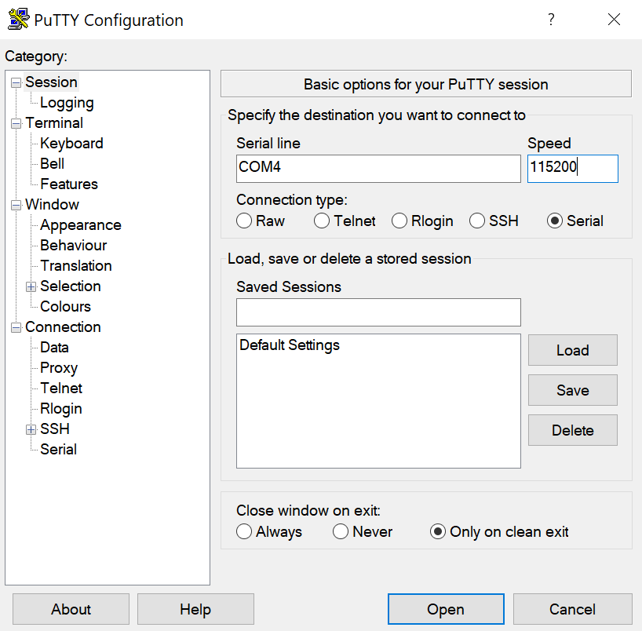

#### UART PLM Log Output

After the serial COM port is setup, follow the [Quick-Start Instructions](#quick-start-instructions) to program the PDI with Vivado Hardware manager. The following should be displayed:

```
[5.554346]****************************************
[7.220718]Xilinx Versal Platform Loader and Manager
[11.916909]Release 2020.2   Dec 13 2020  -  23:47:15
[16.612365]Platform Version: v1.0 PMC: v1.0, PS: v1.0
[21.394462]BOOTMODE: 0, MULTIBOOT: 0x0
[24.872134]****************************************
[29.502681] 25.114646 ms for PrtnNum: 1, Size: 2224 Bytes
[34.609112]-------Loading Prtn No: 0x2
[38.626646] 0.523009 ms for PrtnNum: 2, Size: 48 Bytes
[42.953878]-------Loading Prtn No: 0x3
[116.510206] 70.057318 ms for PrtnNum: 3, Size: 57168 Bytes
[118.960559]-------Loading Prtn No: 0x4
[124.214740] 1.667915 ms for PrtnNum: 4, Size: 2512 Bytes
[127.655975]-------Loading Prtn No: 0x5
[131.250990] 0.014340 ms for PrtnNum: 5, Size: 3424 Bytes
[136.352009]-------Loading Prtn No: 0x6
[139.941196] 0.007809 ms for PrtnNum: 6, Size: 80 Bytes
[144.925340]+++++++Loading Image No: 0x2, Name: pl_cfi, Id: 0x18700000
[151.136950]-------Loading Prtn No: 0x7
[280.724578]ERROR: PlHouseClean: Hard Block Scan Clear / MBIST FAILED
[947.727690] 793.003087 ms for PrtnNum: 7, Size: 747216 Bytes
[950.353909]-------Loading Prtn No: 0x8
[1113.788959] 159.846303 ms for PrtnNum: 8, Size: 152672 Bytes
[1116.533481]+++++++Loading Image No: 0x3, Name: fpd, Id: 0x0420C003
[1122.587556]-------Loading Prtn No: 0x9
[1126.693593] 0.435284 ms for PrtnNum: 9, Size: 1008 Bytes
[1131.511043]***********Boot PDI Load: Done*************
[1136.521765]13027.890018 ms: ROM Time
[1139.982206]Total PLM Boot Time
```

If the UART is not accessible, the PLM log information can still be accessed after the boot attempt completes. The PLM log information accessed by xsct is stored in the PMC RAM. The -log-size option is available if the default 1024 bytes size is too short and truncates the log. Launch the xsct and connect to the target to use the following PLM log command after loading in the JTAG boot reference design.

#### Example xsct PLM Log Output
```
xsct% connect
xsct% ta 1
xsct% device program {C:\jtag_boot\runs\project_1.runs\impl_1\design_1_wrapper.pdi}
xsct% plm log
[4.026025]PLM Initialization Time
[4.063143]***********Boot PDI Load: Started***********
[4.106775]Loading PDI from JTAG
[4.143268]Monolithic/Master Device
[4.229340]0.105806 ms: PDI initialization time
[4.275390]+++++++Loading Image No: 0x1, Name: lpd, Id: 0x04210002
[4.327078]-------Loading Prtn No: 0x1
[5.554346]****************************************
[7.220718]Xilinx Versal Platform Loader and Manager
[11.916909]Release 2020.2   Dec 13 2020  -  23:47:15
[16.612365]Platform Version: v1.0 PMC: v1.0, PS: v1.0
[21.394462]BOOTMODE: 0, MULTIBOOT: 0x0
[24.872134]****************************************
[29.502681] 25.114646 ms for PrtnNum: 1, Size: 2224 Bytes
[34.609112]-------Loading Prtn No: 0x2
[38.626646] 0.523009 ms for PrtnNum: 2, Size: 48 Bytes
[42.953878]-------Loading Prtn No: 0x3
[116.510206] 70.057318 ms for PrtnNum: 3, Size: 57168 Bytes
[118.960559]-------Loading Prtn No: 0x4
[124.214740] 1.667915 ms for PrtnNum: 4, Size: 2512 Bytes
[127.655975]-------Loading Prtn No: 0x5
[131.250990] 0.014340 ms for PrtnNum: 5, Size: 3424 Bytes
[136.352009]-------Loading Prtn No: 0x6
[139.941196] 0.007809 ms for PrtnNum: 6, Size: 80 Bytes
[144.925340]+++++++Loading Image No: 0x2, Name: pl_cfi, Id: 0x18700000
[151.136950]-------Loading Prtn No: 0x7
[280.724578]ERROR: PlHouseClean: Hard Block Scan Clear / MBIST FAILED
[947.727690] 793.003087 ms for PrtnNum: 7, Size: 747216 Bytes
[950.353909]-------Loading Prtn No: 0x8
[1113.788959] 159.846303 ms for PrtnNum: 8, Size: 152672 Bytes
[1116.533481]+++++++Loading Image No: 0x3, Name: fpd, Id: 0x0420C003
[1122.587556]-------Loading Prtn No: 0x9
[1126.693593] 0.435284 ms for PrtnNum: 9, Size: 1008 Bytes
[1131.511043]***********Boot PDI Load: Done*************
[1136.521765]13027.890018 ms: ROM Time
[1139.982206]Total PLM Boot Time
```

Notes:
* Because of the initial UART setup time, the PLM initialization comments can be seen in the stored plm log, accessed from xsct, but not in the UART PLM log display.
* If the -log-size option used is greater than the PLM log data, junk characters will be printed for the rest of the log size and can be ignored.
* For the VCK190 ES1 sample PLM log output, if a MBIST error is seen when running this reference PDI as shown, the ES1 error message can be safely ignored and it will not prevent the device to boot.    

#### Example PLM Log Output with Error

If the design included DDR4, the example PLM log below could be seen on a boot failure. The example log indicates the failure is a DDR calibration failure. The PLM error codes can be found in the Versal ACAP System Software Developers User Guide [(UG1304)](https://www.xilinx.com/support/documentation/sw_manuals/xilinx2020_2/ug1304-versal-acap-ssdg.pdf).

PLM Error Status: 0x032B0000 or 0x032B PLM MAJOR ERROR (DDR calibration error).  

The XPlmi_MaskPoll: Addr: 0xF6110008 entry provides additional information on where the failure happened and can isolate the memory controller affected. If this type of failure is seen, it is recommended to use the Vivado hardware manager for additional debug. This will indicate which memory controllers are seen in the design and which has pass or fail.

##### UART PLM Log DDR4 fail Example

```
7.798309]****************************************
[9.452140]Xilinx Versal Platform Loader and Manager
[14.141896]Release 2020.2   Oct 26 2020  -  06:29:33
[18.831650]Platform Version: v1.0 PMC: v1.0, PS: v1.0
[23.608303]BOOTMODE: 0, MULTIBOOT: 0x0
[27.081640]****************************************
[31.695896] 27.424203 ms for PrtnNum: 1, Size: 2224 Bytes
[36.807609]-------Loading Prtn No: 0x2
[40.979587] 0.692090 ms for PrtnNum: 2, Size: 48 Bytes
[45.141803]-------Loading Prtn No: 0x3
[107.047840] 58.422178 ms for PrtnNum: 3, Size: 57136 Bytes
[109.484068]-------Loading Prtn No: 0x4
[113.064453] 0.014096 ms for PrtnNum: 4, Size: 2512 Bytes
[118.170312]-------Loading Prtn No: 0x5
[121.752993] 0.016503 ms for PrtnNum: 5, Size: 3424 Bytes
[126.855843]-------Loading Prtn No: 0x6
[130.429237] 0.007771 ms for PrtnNum: 6, Size: 80 Bytes
[135.414265]+++++++Loading Image No: 0x2, Name: pl_cfi, Id: 0x18700000
[141.620740]-------Loading Prtn No: 0x7
[277.675778]ERROR: PlHouseClean: Hard Block Scan Clear / MBIST FAILED
[935.840615] 790.647462 ms for PrtnNum: 7, Size: 749952 Bytes
[938.451193]-------Loading Prtn No: 0x8
[3002.459018]XPlmi_MaskPoll: Addr: 0xF6110008,  Mask: 0x10, ExpVal: 0x10, Timeout: 1000000 ...ERROR
[3009.554228]Error loading PL data:
CFU_ISR: 0x00000000, CFU_STATUS: 0x00000A8C
PMC ERR1: 0xE0000000, PMC ERR2: 0xE0000000
[3024.582812]ERROR: PlHouseClean: Hard Block Scan Clear / MBIST FAILED
[3027.998421]PLM Error Status: 0x032B0000
[3031.701640]====Register Dump============
[3035.519762]IDCODE: 0x04CA8093
[3038.383025]EXTENDED IDCODE: 0x00004000
[3042.027168]Version: 0x00301010
[3044.976662]Bootmode User: 0x00000000
[3048.447018]Bootmode POR: 0x00000000
[3051.831306]Reset Reason: 0x00000000
[3055.215443]Multiboot: 0x00000000
[3058.339803]PMC PWR Status: 0x0007FFE0
[3061.897665]PMC GSW Err: 0x00000000
[3065.196093]PLM Error: 0x032B0000
[3068.319903]PMC ERR OUT1 Status: 0xEF000000
[3072.312262]PMC ERR OUT2 Status: 0xE0000000
[3076.304912]GICP0 IRQ Status: 0x00000000
[3080.036268]GICP1 IRQ Status: 0x00000000
[3083.767562]GICP2 IRQ Status: 0x0FF00000
[3087.499962]GICP3 IRQ Status: 0x00000000
[3091.231628]GICP4 IRQ Status: 0x00000000
[3094.963740]GICPPMC IRQ Status: 0x00000000
[3098.868921]====Register Dump============
```

##### xsct PLM Log of the DDR4 Fail Example:

```
xsct% plm log -log-size 4000
[4.004153]PLM Initialization Time
[4.030596]***********Boot PDI Load: Started***********
[4.063834]Loading PDI from JTAG
[4.089340]Monolithic/Master Device
[4.154450]0.084481 ms: PDI initialization time
[4.189756]+++++++Loading Image No: 0x1, Name: lpd, Id: 0x04210002
[4.231178]-------Loading Prtn No: 0x1
[7.798309]****************************************
[9.452140]Xilinx Versal Platform Loader and Manager
[14.141896]Release 2020.2   Oct 26 2020  -  06:29:33
[18.831650]Platform Version: v1.0 PMC: v1.0, PS: v1.0
[23.608303]BOOTMODE: 0, MULTIBOOT: 0x0
[27.081640]****************************************
[31.695896] 27.424203 ms for PrtnNum: 1, Size: 2224 Bytes
[36.807609]-------Loading Prtn No: 0x2
[40.979587] 0.692090 ms for PrtnNum: 2, Size: 48 Bytes
[45.141803]-------Loading Prtn No: 0x3
[107.047840] 58.422178 ms for PrtnNum: 3, Size: 57136 Bytes
[109.484068]-------Loading Prtn No: 0x4
[113.064453] 0.014096 ms for PrtnNum: 4, Size: 2512 Bytes
[118.170312]-------Loading Prtn No: 0x5
[121.752993] 0.016503 ms for PrtnNum: 5, Size: 3424 Bytes
[126.855843]-------Loading Prtn No: 0x6
[130.429237] 0.007771 ms for PrtnNum: 6, Size: 80 Bytes
[135.414265]+++++++Loading Image No: 0x2, Name: pl_cfi, Id: 0x18700000
[141.620740]-------Loading Prtn No: 0x7
[277.675778]ERROR: PlHouseClean: Hard Block Scan Clear / MBIST FAILED
[935.840615] 790.647462 ms for PrtnNum: 7, Size: 749952 Bytes
[938.451193]-------Loading Prtn No: 0x8
[3002.459018]XPlmi_MaskPoll: Addr: 0xF6110008,  Mask: 0x10, ExpVal: 0x10, Timeout: 1000000 ...ERROR
[3009.554228]Error loading PL data:
CFU_ISR: 0x00000000, CFU_STATUS: 0x00000A8C
PMC ERR1: 0xE0000000, PMC ERR2: 0xE0000000
[3024.582812]ERROR: PlHouseClean: Hard Block Scan Clear / MBIST FAILED
[3027.998421]PLM Error Status: 0x032B0000
[3031.701640]====Register Dump============
[3035.519762]IDCODE: 0x04CA8093
[3038.383025]EXTENDED IDCODE: 0x00004000
[3042.027168]Version: 0x00301010
[3044.976662]Bootmode User: 0x00000000
[3048.447018]Bootmode POR: 0x00000000
[3051.831306]Reset Reason: 0x00000000
[3055.215443]Multiboot: 0x00000000
[3058.339803]PMC PWR Status: 0x0007FFE0
[3061.897665]PMC GSW Err: 0x00000000
[3065.196093]PLM Error: 0x032B0000
[3068.319903]PMC ERR OUT1 Status: 0xEF000000
[3072.312262]PMC ERR OUT2 Status: 0xE0000000
[3076.304912]GICP0 IRQ Status: 0x00000000
[3080.036268]GICP1 IRQ Status: 0x00000000
[3083.767562]GICP2 IRQ Status: 0x0FF00000
[3087.499962]GICP3 IRQ Status: 0x00000000
[3091.231628]GICP4 IRQ Status: 0x00000000
[3094.963740]GICPPMC IRQ Status: 0x00000000
[3098.868921]====Register Dump============
```

# Resources for Custom Board Bring-up
This tutorial loads an example reference design into the VCK190, which has a power delivery solution option with Infineon. Each custom board must manage Versal ACAP power up and sequencing based on application requirements. The VCK190 may not be optimal for all solutions. For custom boards, review the example power delivery solutions for Versal ACAPs at http://www.xilinx.com/power.

The best practices described in this section are a few key general checks for custom board bring-up. These are applicable regardless of the power solution that the board has selected and may refer to the VCK190 as an example.

If boot debug is required during custom board bring-up, check that the REF_CLK is running before the POR_B signal is released. Next, ensure the key power rails VCC_PMC, VCCAUX_PMC, and VCCO_503 are at expected levels before the POR_B is released. If these are as expected, the other power rails used should be checked and compared against Xilinx power estimator (XPE) to ensure proper sequencing.

## Power Rails:
When bringing up a new board, basic voltage power rail checks for level and sequence are recommended. Refer to the Xilinx Power Estimator User Guide for Versal ACAP [(UG1275)](https://www.xilinx.com/support/documentation/sw_manuals/xilinx2020_2/ug1275-xilinx-power-estimator-versal.pdf) for sequence details, information on rail relationship to domain and components, and recommended examples for different applications. Refer to Versal AI Core Series Data Sheet: DC and AC Switching Characteristics [(DS957)](https://www.xilinx.com/support/documentation/data_sheets/ds957-versal-ai-core.pdf) for the operating range of each power rail. Verify that the power rails used are within the appropriate specification levels for the selected family and speed grade.

The VCK190 (ES1) board brings up the power rails with an solution using Infineon. The following table provides an example of the rail order brought up. The VCK190 ES1 power delivery solution keeps the VCC_RAM powered off until the device PL isolation is established with the on-board system controller as an ES1 power sequence requirement.


#### VCK190 Sample Sequence

| Sequence Group| Power Rails |
|------------|----------|
| 1 | <li> VCC12_SW <li> UTIL_3V3 <li> UTIL_5V0|
| 2 | <li> UTIL_1V13 <li> UTIL_2V5 <li> DIMM1_VTERM|
| 3 | <li>VCCINT <li> VCC_PMC <li> VCC_RAM <li> VCC_PSLP <li> VCC_PSFP <li> VCC_SOC <li> MGTYAVCC |
| 4 | <li>VCCAUX <li> VCCAUX_PMC <li> MGTYAVTT|
| 5 | <li> VCCO_MIO <li> VCC1V8 <li> VCC3V3 <li> VCC1V2_DDR4 <li> VCC1V1_LP4 <li> VADJ_FMC <li> MGTYVCCAUX |

The following is one of several example checks to ensure that the power rail sequence and levels correct and meet the data sheet requirements. When bringing up a board, confirm that the rails are coming up to valid levels and in a sequence, as described in the Xilinx Power Estimator User Guide for Versal ACAP [(UG1275)](https://www.xilinx.com/support/documentation/sw_manuals/xilinx2020_2/ug1275-xilinx-power-estimator-versal.pdf). For this ES1 example, VCC_RAM ramp is held low until the PL isolation is applied and then the power rail is ramped.

#### Sequence Group 3 Example


## Clocking and Reset

* Verify the REF_CLK clock is stable before POR_B is released and follows the data sheet specification. The REF_CLK default setting in CIPS will be 33.333MHz, the same REF_CLK frequency the VCK190 uses.

* Verify that the REF_CLK input is running and the PMC power rails (VCC_PMC, VCCAUX_PMC, and VCCO_503) are stable (at minimum) before the POR_B pin is released. When POR_B is released it will begin the boot and initialization process. Refer to Xilinx Power Estimator User Guide for Versal ACAP [(UG1275)](https://www.xilinx.com/support/documentation/sw_manuals/xilinx2020_2/ug1275-xilinx-power-estimator-versal.pdf) for additional sequencing detail.

## Interfaces Recommended for Custom Board Bring-up (JTAG and UART)

For custom board bring-up, it is helpful to have both UART and JTAG access. JTAG provides the simplest boot mode access to the Versal ACAP. UART can be used for PLM execution status and debug.

##### JTAG Interface
* JTAG is the simplest boot mode and recommended for initial Versal ACAP custom board bring-up.
* System monitor and registers (JTAG and memory mapped) can be accessed to provide status on boot, to monitor the device, and for debug.
* Connect the standard IEEE 1149.1 JTAG signals (TCK, TMS, TDI, TDO), as instructed in Versal ACAP Schematic Review Checklist (XTP546) and Versal ACAP PCB User Guide [(UG863)](https://www.xilinx.com/support/documentation/user_guides/ug863-versal-pcb-design.pdf).
* JTAG is a valuable debug interface even if another primary boot mode is selected for production. Provide access to set the mode pins (MODE[3:0]=0000) to JTAG boot mode for initial boot board bring-up and debugging future updates.
* JTAG boot mode can also be accessed after a system reset with the BOOT_MODE_USER register if the boot mode pins are not accessible from power up. Vivado Hardware Manager uses the BOOT_MODE_USER register to set JTAG boot mode register to indirectly programming flash that is accessible by PMC controllers (i.e., QSPI, OSPI, and eMMC). Refer to the [Versal ACAP Register Reference](https://www.xilinx.com/html_docs/registers/am012/am012-versal-register-reference.html#pmc_global___pmc_err1_status.html) for more details on this register.

 Note: Custom boards using SelectMAP should have JTAG boot mode in access. In this slave boot mode, if the solution is not being driven there is a longer timeout (~30 min). Having the option to set to JTAG mode during debug reduces time.

##### UART Interface:
* Ensure the UART interface is connected, as instructed in Versal ACAP Schematic Review Checklist (XTP546) and Versal ACAP PCB User Guide [(UG863)](https://www.xilinx.com/support/documentation/user_guides/ug863-versal-pcb-design.pdf) recommendations.
* Provides a method to view PLM execution, boot status, and advanced debug with boot timestamps.

 Note: UART access is recommended, but in cases that the UART is not accessible, access the PLM log with the xsct command. The PLM log is a valuable debug output. The -log-size option should be used if an error is encountered to get the full PLM log and register dump. By default, the PLM log buffer size is 1024 bytes.

```
xsct% connect
xsct% ta 1
xsct% plm log -log-size 4000
```
For additional detail on the PLM log command use the following:
```
xsct% plm log -help
```

## General Custom Board Review 
* Versal ACAP Schematic Review Checklist (XTP546) recommendations should be followed. See the schematic review checklist for the user selected peripherals, MIO, and dedicated IO usage.

* Versal ACAP PCB User Guide [(UG863)](https://www.xilinx.com/support/documentation/user_guides/ug863-versal-pcb-design.pdf) recommendations should be followed. Refer to this user guide for interface recommendations on trace lengths, pull-ups and pull-downs, guidance on simulation, and PCB interface requirements.

* VCK190 schematic can be used as an example reference.
  * [VCK190 schematic example](https://www.xilinx.com/member/vck190_headstart/VCK190_VMK180_REVA04.pdf)
  * [VCK190 constraints file example](https://www.xilinx.com/member/vck190_headstart/vck190_vmk180_Master_XDC.zip)


* Versal ACAP Technical Reference Manual [(AM011)](https://www.xilinx.com/support/documentation/architecture-manuals/am011-versal-acap-trm.pdf) should be reviewed for general hardware boot information, details on the PMC and PS flash controllers, peripheral interfaces, and MIO options.

* Versal ACAP System Software Developers User Guide [(UG1304)](https://www.xilinx.com/support/documentation/sw_manuals/xilinx2020_2/ug1304-versal-acap-ssdg.pdf) should be reviewed for boot flow information and use cases (i.e., MultiBoot or secondary boot requirements).

* For custom boards with non-Xilinx devices included in the JTAG device chain, ensure the other non-Xilinx devices are fully JTAG compliant. If the non-Xilinx devices use optional signals (i.e., TRST) ensure they are tied appropriately since Xilinx devices do not support.

# References

|Reference|Description|
|  ---  |  ---  |
|VCK190 User Guide (UG1366)|Contains Versal evaluation board information.|
|Vivado Design Suite (UG910)|Contains Vivado software related information.|
|Vitis Unified Software Platform Documentation Embedded Software Development User guide [(UG1400)](https://www.xilinx.com/support/documentation/sw_manuals/xilinx2020_2/ug1400-vitis-embedded.pdf)|Contains Vitis software platform related information.|
|[Vitis Unified Software Platform](https://www.xilinx.com/html_docs/xilinx2020_2/vitis_doc/index.html)|Contains Vitis related information.|
|Versal ACAP Design Guide [(UG1273)](https://www.xilinx.com/support/documentation/sw_manuals/xilinx2020_2/ug1273-versal-acap-design.pdf)|Contains top level methodology guidelines for design flow including boot.|
|Versal ACAP Technical Reference Manual [(AM011)](https://www.xilinx.com/support/documentation/architecture-manuals/am011-versal-acap-trm.pdf)|Contains information on Versal ACAP hardware architecture overview and PMC and PS hardware block information.|
|Versal ACAP System Software Developers User Guide [(UG1304)](https://www.xilinx.com/support/documentation/sw_manuals/xilinx2020_2/ug1304-versal-acap-ssdg.pdf)|Contains information about  PMC and PS software development.|
|CIPs IP LogiCore Product Guide [(PG352)](https://www.xilinx.com/support/documentation/ip_documentation/versal_cips/v2_1/pg352-cips.pdf)|Contains configuration information on MIO and PMC/PS peripherals and controllers settings.|
|Binary Counter LogiCORE IP Product Guide [(PG121)](https://www.xilinx.com/support/documentation/ip_documentation/counter_binary/v12_0/pg121-c-counter-binary.pdf)| Contains binary counter LogiCORE IP details.|
|SmartConnect LogiCORE IP Product Guide [(PG247)](https://www.xilinx.com/support/documentation/ip_documentation/smartconnect/v1_0/pg247-smartconnect.pdf)|Contains SmartConnect LogiCORE IP details.|
|AXI GPIO LogiCORE IP Product Guide [(PG144)](https://www.xilinx.com/support/documentation/ip_documentation/axi_gpio/v2_0/pg144-axi-gpio.pdf)|Contains AXI GPIO LogiCORE IP details.|
|Processor System Reset Module LogiCORE IP Product Guide [(PG164)](https://www.xilinx.com/support/documentation/ip_documentation/proc_sys_reset/v5_0/pg164-proc-sys-reset.pdf)|Contains Processor System Reset LogiCORE IP details.|
|Vivado Design Suite Tcl Command Reference Guide [(UG835)](https://www.xilinx.com/support/documentation/sw_manuals/xilinx2020_1/ug835-vivado-tcl-commands.pdf)|Contains Vivado TCL commands.|
|Vivado Design Suite User Guide [(UG908)](https://www.xilinx.com/support/documentation/sw_manuals/xilinx2020_2/ug908-vivado-programming-debugging.pdf)|Contains the hardware manager JTAG programming information and debug tools.|
|Xilinx Power Estimator User Guide for Versal ACAP [(UG1275)](https://www.xilinx.com/support/documentation/sw_manuals/xilinx2020_2/ug1275-xilinx-power-estimator-versal.pdf)|Contains information on power estimation for Versal ACAP devices.|
|Embedded Design Tutorial [(UG1305)](https://www.xilinx.com/cgi-bin/docs/rdoc?v=latest;d=ug1305-versal-acap-edt.pdf)|Tutorial that covers Versal boot using SD and QSPI.|
|Versal BootGen User Guide [(UG1283)](https://www.xilinx.com/support/documentation/sw_manuals/xilinx2020_2/ug1283-bootgen-user-guide.pdf)|Contains information on the programmable device image (PDI) format and PDI generation.|
|Versal ACAP PCB User Guide [(UG863)](https://www.xilinx.com/support/documentation/user_guides/ug863-versal-pcb-design.pdf)|Contains custom board PCB layout information, covers boot mode interfaces dedicated to MIO pins.|
|Versal Schematic Checklist [(XTP546)](https://www.xilinx.com/cgi-bin/docs/rdoc?v=latest;d=xtp546-versal-acap-schchklst.pdf)|Contains custom board checklist information, covers boot mode interface dedicated and MIO pins.|
|Versal Register Reference [(AM012)](https://www.xilinx.com/html_docs/registers/am012/am012-versal-register-reference.html)|Contains Versal PS and PMC related register information.|
|Versal AI Core Series Data Sheet: DC and AC Switching Characteristics [(DS957)](https://www.xilinx.com/support/documentation/data_sheets/ds957-versal-ai-core.pdf)|Contains Versal DC and AC switching characteristics.|
|[Xilinx Board Store](https://github.com/Xilinx/XilinxBoardStore)|Contains resources for Xilinx, Avnet, and other example evaluation boards.|


© Copyright 2020 Xilinx, Inc.

Licensed under the Apache License, Version 2.0 (the "License"); you may not use this file except in compliance with the License. You may obtain a copy of the License at

http://www.apache.org/licenses/LICENSE-2.0
Unless required by applicable law or agreed to in writing, software distributed under the License is distributed on an "AS IS" BASIS, WITHOUT WARRANTIES OR CONDITIONS OF ANY KIND, either express or implied. See the License for the specific language governing permissions and limitations under the License.
