<table>
 <tr>
   <td align="center"><h1>2020.2 Versal™ Network on Chip/Multiple DDR Memory Controllers Tutorial</h1>
   </td>
 </tr>
</table>

# Example Design Template

## **Design Summary**

This tutorial presents an example desing that shows how to connect many different DDR devices simultaneously in one design.
Following this tutotial, brings the following awareness:
- the required IPs to achieve such a design.
- how to configure NoC and DDRMC.
- how it's mandatory to instantiate a different NoC IP for each DDRMC (none interleaved controllers).
- the possibility to interleave multiple "similar" DDR devices (2 or 4 devices) and how to use only one NoC instance for that case.
- how to connect multiple NoC instances through Inter-NoC Interfaces.
- how to create a Vitis Project based on that design and to test a simple code that access all of these memory devices.

---

## **Required Hardware**

Platform: Versal

Board: VCK190 (same steps applied for VMK180)

Tool: Vivado and Vitis 2020.2

---

## **Block Diagram**

---

## **Build Instructions - From GitHub**

### **Vivado:**

Enter the `Scripts` directory. From the command line run the following:

`vivado -source *top.tcl`

The Vivado project will be built in the `Hardware` directory.

### **Vitis:**
Create a HelloWorld project using the XSA file generated from the above Vivado project.
Replace the content of the helloworld.c with the content of ./Software/ddr4_lpddr4.c from this repo.

---

## **Build Instructions - Manual Steps**

### **Vivado:**

  - Create a new Vivado project for VCK190.
  - Create a new Block Design:

  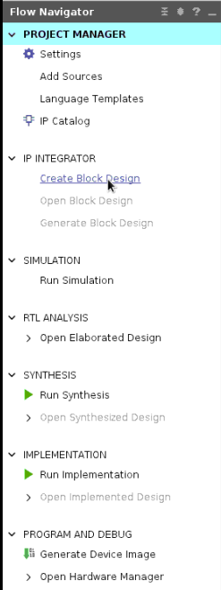

  

  - Add CIPS IP:

  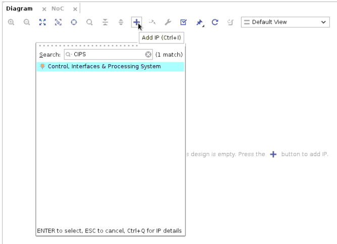

  - Run Block Automation:

    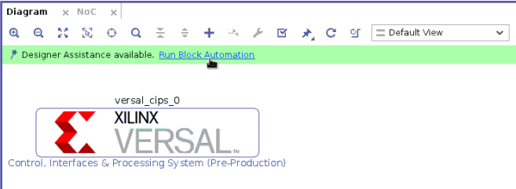
    - Enable 1 Memory Controller (this will be used to connect the DDR4 device on the board):

    

    - This instantiates an AXI NoC IP and connect it to CIPS automatically:

    

  - Double click on the CIPS IP instance and set the PS interface to cips fixed io:

  

  - Double click on the AXI NoC instance to make further configurations:
    - On the Board tab, connect the DDR4 IP interface to the board interface:

    

    - On the General tab:
      - Enable 4 Inter-NoC Master Interfaces. These interfaces are needed to connect to the second AXI NoC instance that will be added later.
      - Set the Number of Memory Controller Ports to 4 for a maximum possible bandwidth.
      - Make sure that the first DDR region is mapped to DDR LOW0 (to access the first 2G of the DDR4).
      - Map the second region to DDR LOW1 to be able to access the rest of the DDR4 device memory.

      

    - On the Inputs tab, check the Inputs clocks:

    

    - On the Connectivity tab, apply the following settings:

    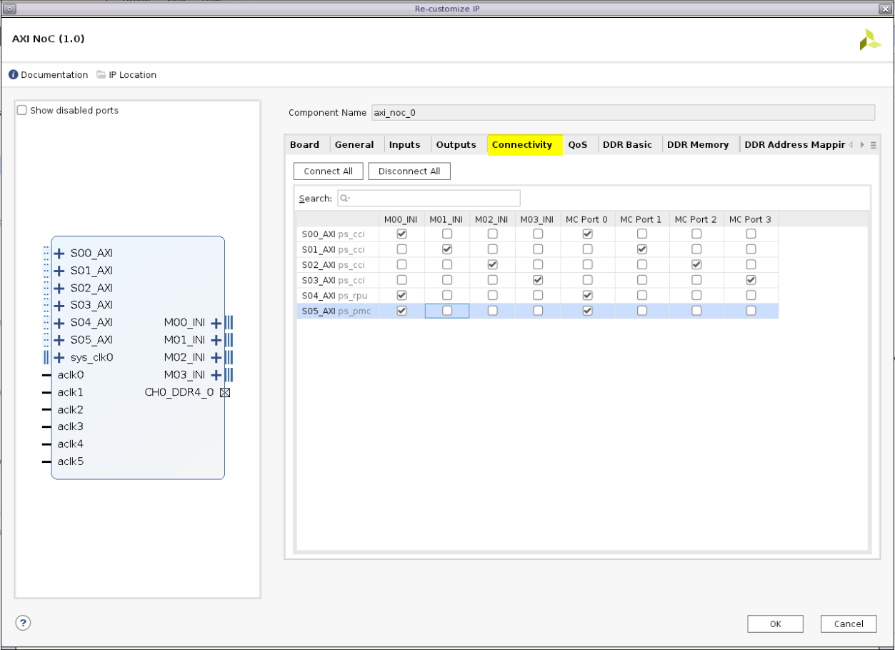

  - To correctly reflect the changes applied above on the Board tab, we should add the following steps:
    - Remove the following connections:

    

    - By doing this we will get the option to Run Connection Automation:

    

    - Run Connection Automation and select All Automation:

    

    - This will map CH0_DDR4_0 and sys_clk0 to the right interfaces on the board as we have specified on the NoC "Board" tab:

    

  - Add a new AXI NoC instance. This will be used to connect to the LPDDR4:

  
    - For this case we don't need to Run Block Automation.

  - Double click on the new AXI NoC to do further configuration:

    - On the Board tab, connect the LPDDR4 IP interfaces to the board interfaces:

    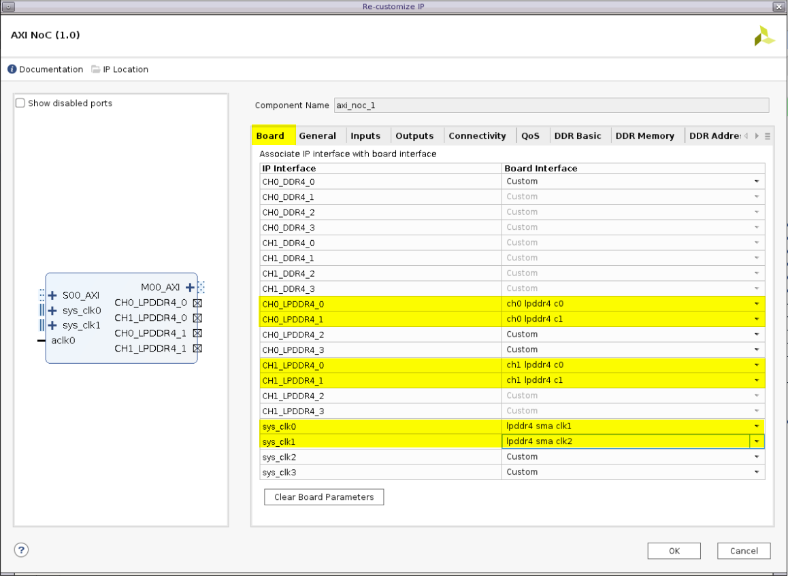

    - On the General tab:
    
      - Set the number of AXI Slaves/Masters and Clocks to 0.
      - Enable 4 Inter-NoC Slave Interfaces. These interfaces are needed to connect to the first AXI NoC instance that we have added before.
      - Set the Number of Memory Controller Ports to 4 for a maximum possible bandwidth.
      - Set Interleave Sive in Bytes to 256 at least, to match the NoC packet size.
      - Map the address region to a region different that the one we used to access the DDR4. In this example we choose the DDR CH1.

      

    - On the Connectivity tab, apply the following settings:
    
    

  - Run Connection Automation:

  

  - Check All Automation:

  

  - Connect both AXI NoC instances through the 4 INI interfaces:

  

  - Regenerate Layout to get a BD layout similar to the one shown in the Block Diagram section:

  

  - From Address Editor tab, Click on Assign All:

  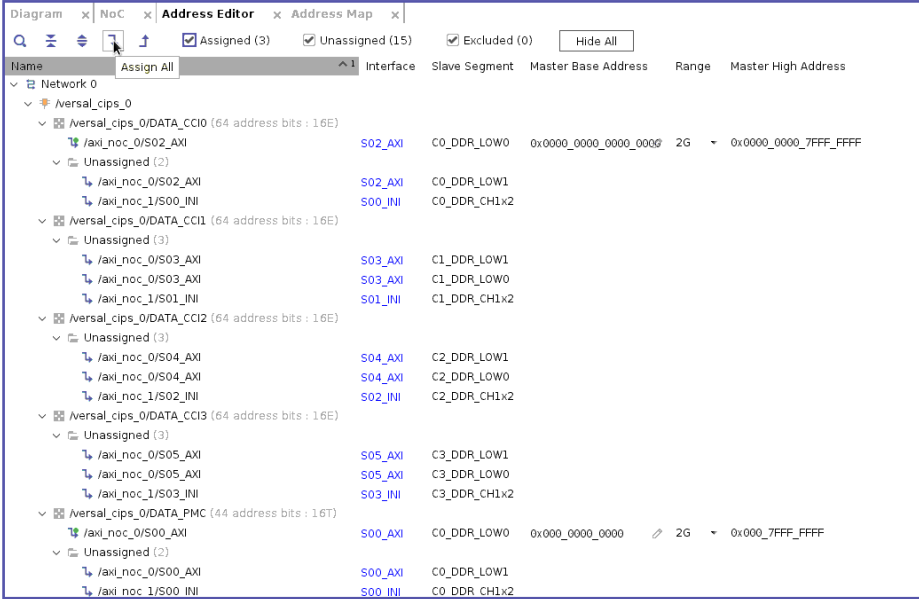

  - Validate Design

    

    - You will get the following pop-up window if the design is valid:

    

  - Create HDL Wrapper:

  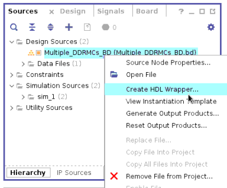

  - Generate Output Products:

  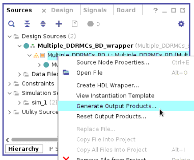

  - Run Synthesis, Implementation and Generate Device Image:

  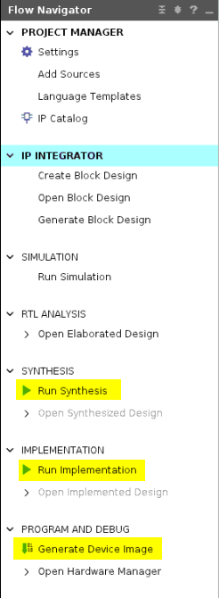

  - Export Hardware:

    

    - Make sure to include device image:

    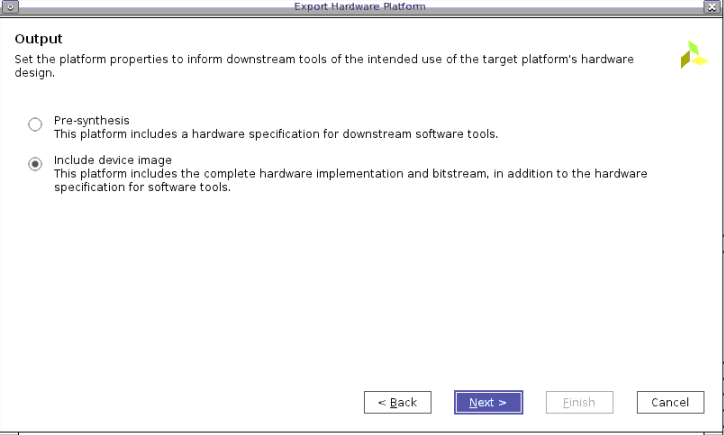

    This generates the .XSA file to be used later with Vitis to create an application project

### **Vitis:**
  - Open Vitis and create an application project:

    

    - Click Next.
    
    - From the following window select the "Create a new platform from hardware (XSA)" tab, then select the XSA file created previously:

    

    - Click Next.

    - Name your project, in this example, we named it ddr4_lpddr4_access:

    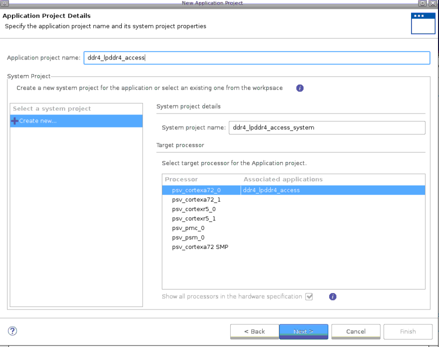

    - Click Next, and keep the default settings for that window.

    - Chose Hello World template and click Finish:

    

  - Open helloworld.c and replace its content by the content of ./Software/ddr4_lpddr4.c:

	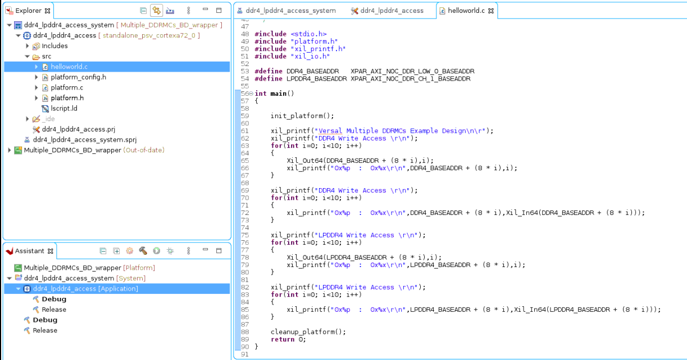

  - Click on the application project, then click on the build icon to build the project:

    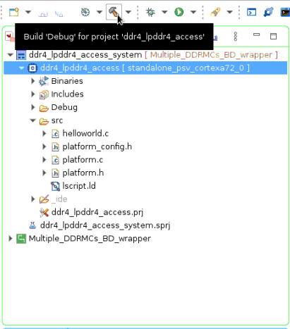

  - Right click on the application project and open the Debug Configuration window:

    

    - Double click on the "Single Application Debug" to create a new configuration:

    

    - On the new debug configuration, do the following:

      - On Main tab, make sure to set the right target on "Connection" where you have hw_server running:

      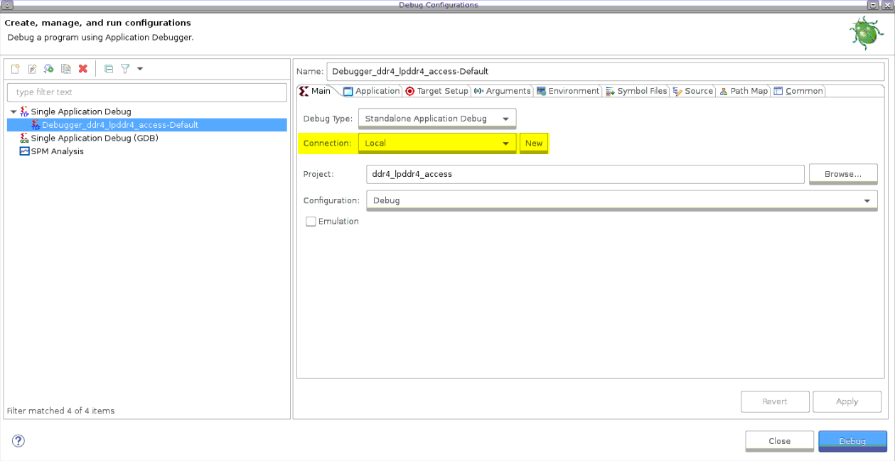

      - Uncheck "Stop at 'main'" option as we are not interested to stop at main:

      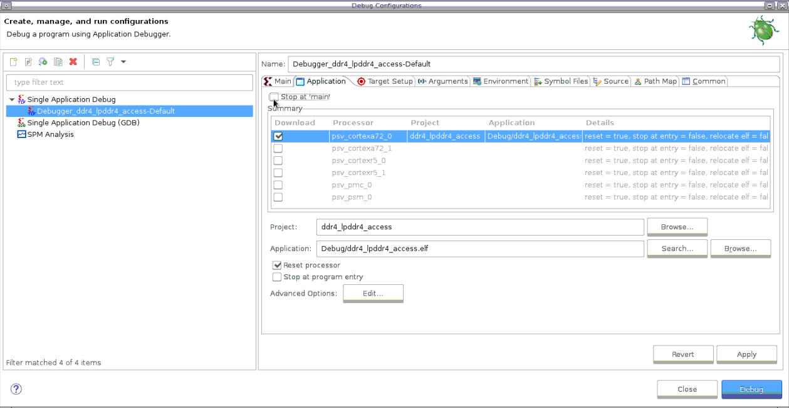

      - Click Debug, to run the application on your VCK190.

  - By running the application, we will get the following UART output, showing the reads and the writes to DDR4 then to LPDDR4:

  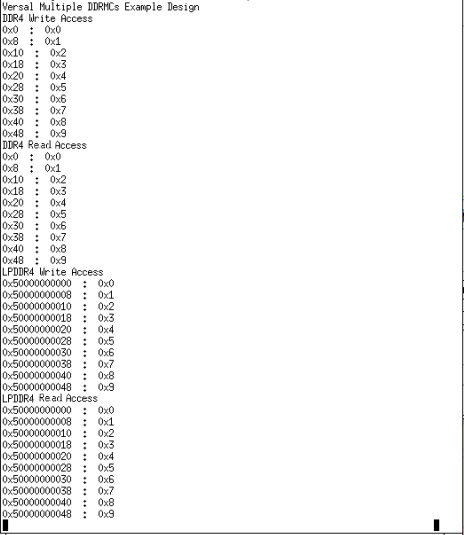
 
  - You could also try to access the DDR4 and LPDDR4 address ranges using XSCT:

  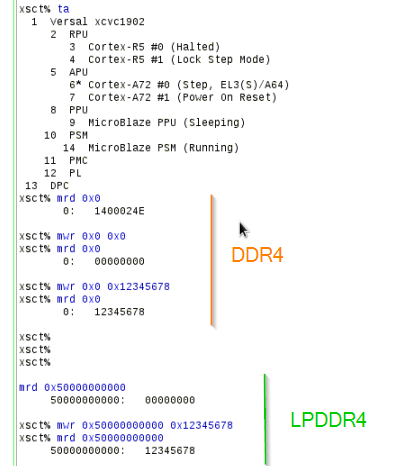

---
## **Troubleshooting / Assistance**
If you find you are having difficulty bringing up one of the designs, or need some additional assistance, please reach out on the [Xilinx Community Forums](https://forums.xilinx.com).

Be sure to [search](https://forums.xilinx.com/t5/forums/searchpage/tab/message?advanced=false&allow_punctuation=false&inactive=false) the forums first before posting, as someone may already have the solution!

---
Copyright 2020 Xilinx Inc.

Licensed under the Apache License, Version 2.0 (the "License");
you may not use this file except in compliance with the License.
You may obtain a copy of the License at

http://www.apache.org/licenses/LICENSE-2.0

Unless required by applicable law or agreed to in writing, software
distributed under the License is distributed on an "AS IS" BASIS,
WITHOUT WARRANTIES OR CONDITIONS OF ANY KIND, either express or implied.
See the License for the specific language governing permissions and
limitations under the License.
